<style>
.small-code pre code {
  font-size: 1em;
}
</style>

Geospatial Data Analysis in R
========================================================
author: Timothy H. Keitt
date: May 20, 2018
width: 1440
height: 900

Instructor
========================================================
type: section

Tim Keitt \<tkeitt@utexas.edu\>

Tim's research
========================================================

I study the spatial and temporal organization of populations, communities and ecosystems.

- Undergrad: Zoology
- Masters: Environmental Engineering
- PhD: Ecology and Evolutionary Biology
- Prof. Integrative Biology, UT

More at http://www.keittlab.org/

Tim's research
========================================================

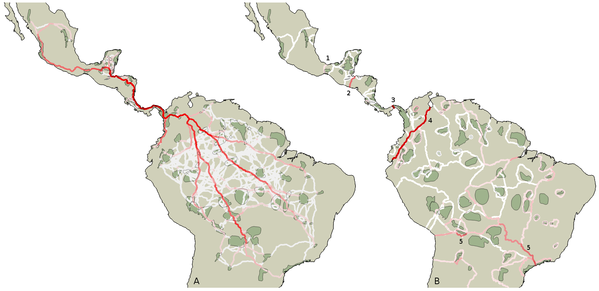

A little history
========================================================

- Discovered R around 1998
- Moving away from PERL and MATLAB
- Hated the syntax at first (had to unlearn)
- Loved that it was open source

A little history
========================================================

- Wrote one of first RDMS interfaces for R: RPgSQL
- Contributed to the `DBI` standard now widely used
- Moved most of my research informatics to R, C++ and PostgreSQL
- Several packages on CRAN and several in development

A little history
========================================================

- Circa 2000 I wrote a simple wrapper for GDAL
- Geospatial Data Abstraction Library
- Reads and writes many GIS data formats
- Formed the basis of the R GIS environment
- `rgdal` number 62 of top 100 downloaded packages on CRAN
- A lot of community development since then

A little history
========================================================

- Circa 2005 Bivand et al. introduce `sp` classes
- Provided a common R-based framework for spatial data
- `sp` integrated into rgdal
- Good
  - Uniform data structures
  - Works with many other packages
- Bad
  - R S4 data structures inefficient
  - Read everything into memory

New developments
========================================================

- Simple Features package `sf`
- Spatial elements now individual objects
- Mirrors developments in database world
- `raster` package handles raster operations

Why R?
========================================================
type: section

Why R?
========================================================

- De facto standard for data analysis and modeling
- Good general purpose programming language
- Combines imperative, functional and array-based programming models
- Massive library of user contributed code: http://cran.r-project.org/

Why R?
========================================================


***

- \> 10,000 packages on CRAN
- Nearly every conceivable data analysis approach
- Task views: http://cran.r-project.org/web/views/
- Big data and high performance extensions
- Sometimes helpful community

Why R?
========================================================

- Non-proprietary open-source
- Facilitates sharing
- "Lots of eyes" to catch bugs
- Lots of community knowledge
- Reproducible research paradigm

***

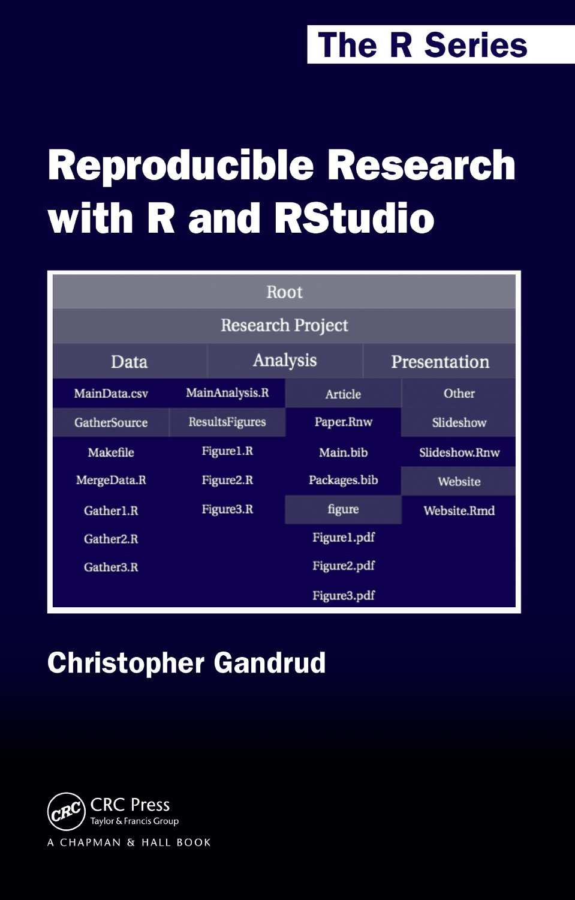

Caveat emptor!
========================================================

- No one paid to ensure correctness
- Lots of experimental codes
  - A good idea to simulate artificial data and test packages for correct results
- Not the fastest or most memory efficient
- Steep learning curve
  - Array-based programming is confusing
- Solutions to all, so not a deal breaker
  - Just be aware is all

Why R for GIS?
========================================================
type: section

Why R for GIS?
========================================================

- All the benefits of R, plus GIS capability
- Reads and writes nearly all file types
- Knits geospatial data with a powerful statistics and data analysis engine
- Fully programmable, so not constrained to "canned" routes in commercial packages

Why R for GIS?
========================================================


A quick example
========================================================


```r
data(meuse) # load sample data from sp pacakge
meuse <- st_as_sf(meuse, coords = c("x", "y")) # convert to sf format
```

A quick example
========================================================
class: small-code


```r
ggplot(meuse) +
  geom_sf(aes(color = rank(zinc)), size = 2, show.legend = FALSE) +
  scale_color_distiller(palette = "Spectral") +
  xlab("Easting") + ylab("Northing") +
  coord_sf() + theme_bw()
```

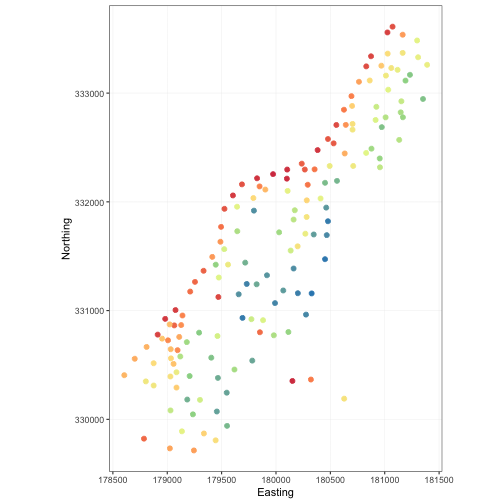

Another example
========================================================
class: small-code

Adapted from [Create Maps With R Geospatial Classes and Graphics Tools](https://www.nceas.ucsb.edu/scicomp/usecases/CreateMapsWithRGraphics). (Note that their example files have spatial reference systems that need correcting. Does not influence plotting.)


```r
nceas_dat <- "materials/lectures/example-data/NCEAS sample"
states <- read_sf(system.file(nceas_dat, "western-states.shp", package = "ssi2018"))
reservoirs <- read_sf(system.file(nceas_dat, "western-reservoirs.shp", package = "ssi2018"))
rivers <- read_sf(system.file(nceas_dat, "western-rivers.shp", package = "ssi2018"))
dams <- read_sf(system.file(nceas_dat, "western-dams.shp", package = "ssi2018"))
st_crs(reservoirs) <- st_crs(states) # quick fix for missing CRS
```

Another example
========================================================
class: small-code

Adapted from [Create Maps With R Geospatial Classes and Graphics Tools](https://www.nceas.ucsb.edu/scicomp/usecases/CreateMapsWithRGraphics).


```r
ggplot() +
  geom_sf(data = states, color = "wheat3", fill = "wheat1") +
  geom_sf(data = rivers, color = "dodgerblue3") +
  geom_sf(data = reservoirs, color = "darkgreen", fill = "darkgreen") +
  geom_sf(data = dams, color = "darkred") +
  geom_label_repel(aes(LONGITUDE, LATITUDE, label = DAM_NAME), data = dams, size = 2, alpha = 0.5) +
  coord_sf() + theme_bw()
```

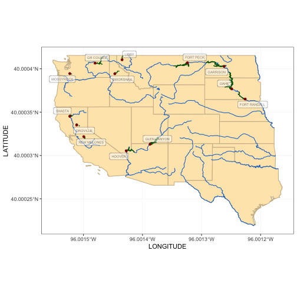

Another example
========================================================
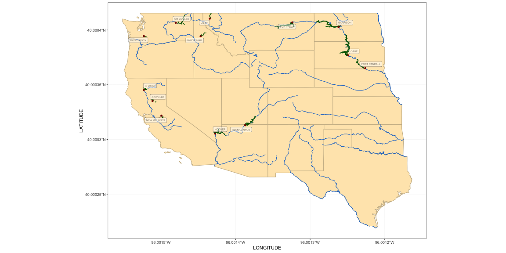

Geospatial data concepts
========================================================
type: section

Geospatial data concepts
========================================================
type: sub-section
- **Types of geospatial data**
- Vectors and simple features
- Raster data
- Topologies
- Networks
- Accuracy and precision
- Map projections
- Spatial indices

Types of geospatial data
========================================================
Vector data
- Points
- Lines
- Polygons

***

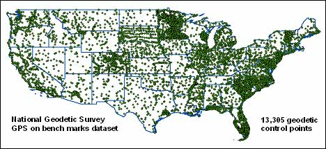

Types of geospatial data
========================================================
Raster data
- Spatial grids
- Lookup tables

***


Types of geospatial data
========================================================
Topology
- Areal data
- Vertices
- Faces

***


Types of geospatial data
========================================================
Network
- Relational
  - Vertices
  - Edges
- Planar network
  - Topology is a special case

***

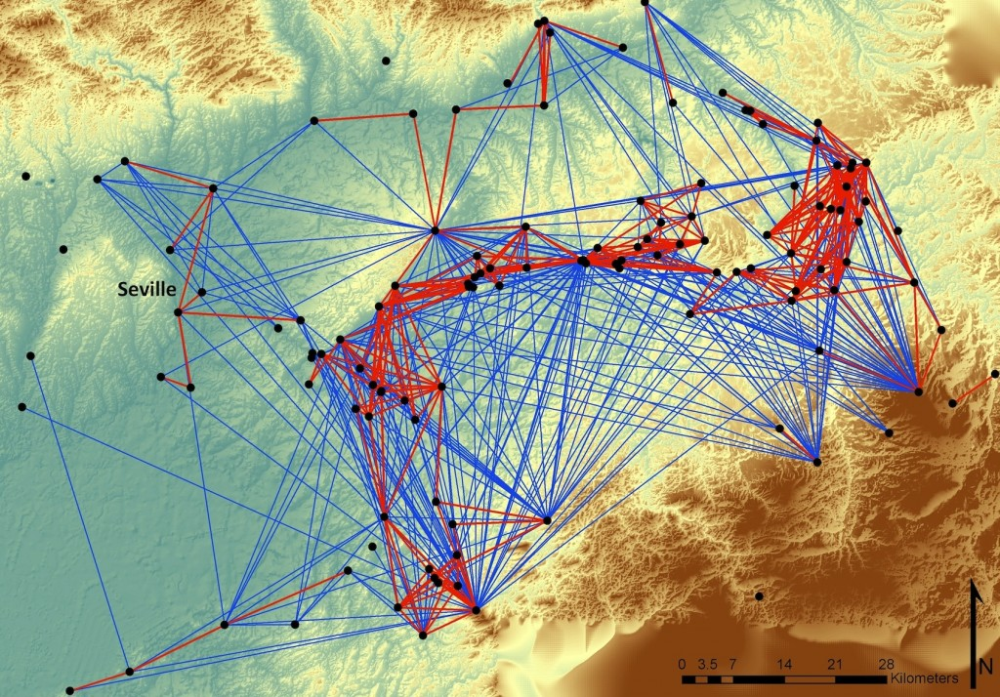

Geospatial data concepts
========================================================
type: sub-section
- Types of geospatial data
- **Vectors and simple features**
- Raster data
- Accuracy and precision
- Map projections
- Spatial indices

Geospatial data concepts
========================================================
OGC Simple Feature Hierarchy


Geospatial data concepts
========================================================
OGC Simple Feature Hierarchy


Geospatial data concepts
========================================================
OGC Simple Feature Predicates


Geospatial data concepts
========================================================
OGC Simple Feature Set Operations


Handled by GEOS library; bindings in `rgeos` package

Geospatial data concepts
========================================================
type: sub-section
- Types of geospatial data
- Vectors and simple features
- **Raster data**
- Accuracy and precision
- Map projections
- Spatial indices

Geospatial data concepts
========================================================
Raster data


Location is implicit using row and column offsets

Geospatial data concepts
========================================================
Raster data

- Models spatial field of measurements
- May have a mask to indicate region of interest
- Cells can represent
  - Point measurements, usually at cell center
  - Areal data integrated over the cell surface
- Unfortunately not always made explicit

***


Geospatial data concepts
========================================================
Raster data

For geospatially registered data, two coordinate systems
- Row and column offsets
- Geospatial coordinates

For many spatial reference systems, conversion from map coordinates to raster offsets can be achieved via an *affine transform*.

$$ \begin{bmatrix} x \\ y \end{bmatrix} = \begin{bmatrix} x_0 \\ y_0 \end{bmatrix} +
\begin{bmatrix} a_{11} & a_{12} \\ a_{21} & a_{22} \end{bmatrix} \begin{bmatrix} c \\ r \end{bmatrix} $$

$$ \begin{bmatrix} a_{11} & a_{12} \\ a_{21} & a_{22} \end{bmatrix}^{-1} \left( \begin{bmatrix} x \\ y \end{bmatrix} - \begin{bmatrix} x_0 \\ y_0 \end{bmatrix} \right) =
 \begin{bmatrix} c \\ r \end{bmatrix} $$

If $a_{11}$ or $a_{22}$ are negative, then axis is "flipped".

Geospatial data concepts
========================================================
Affine transforms


Geospatial data concepts
========================================================
type: sub-section
- Types of geospatial data
- Vectors and simple features
- Raster data
- **Accuracy and precision**
- Map projections
- Spatial indices

Geospatial data concepts
========================================================
Accuracy and precision

- Spatial data is neither perfectly accurate nor perfectly precise
- Most common are shifts and rotations leading to inaccurate spatial locations

***


Geospatial data concepts
========================================================
Accuracy and precision

- Raster cell locations are precise (relative to their spatial reference system) but not typically accurate
- Unusual for satellite images to be more accurately placed than 1/2 pixel width (and that is very good)
- Often a process of establishing ground control points with known geographic location

***

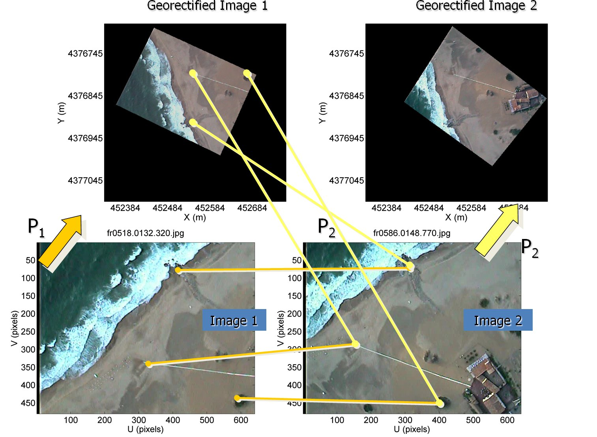

Geospatial data concepts
========================================================
Resampling

- Generate new corrected grid
- Sample values from old grid to fill in values in new grid

***

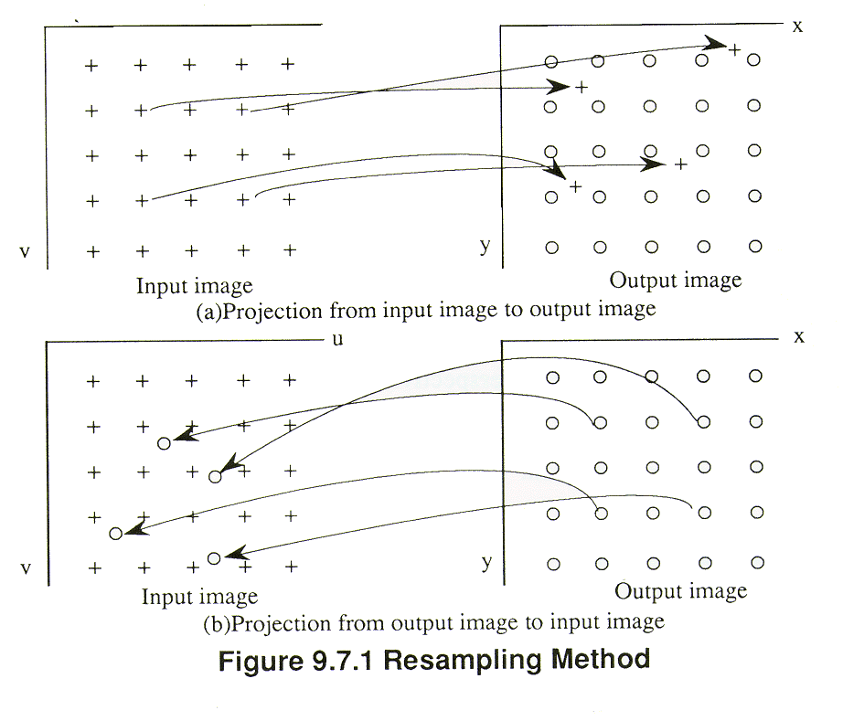

Geospatial data concepts
========================================================
Resampling methods

- Nearest neighbor: good for categorical data
- Interpolation: better for continuous data

***

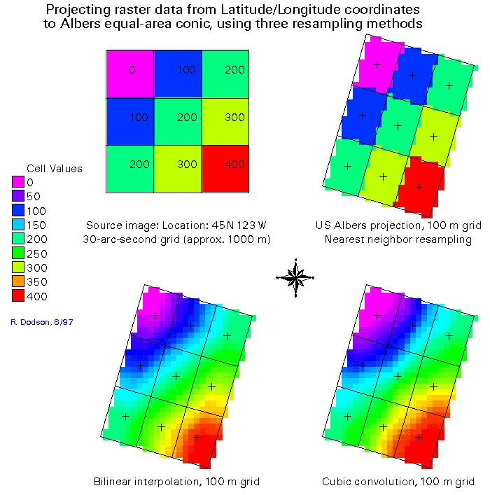

Geospatial data concepts
========================================================
Accuracy and precision

- Imprecise and inaccurate vector geometries lead to topological errors
- Classic case is when lines that are supposed to be coincident cross
- These cases are not handled well in the majority of open source GIS tools, the exception being topology support in GRASS and preliminary support in PostGIS

***

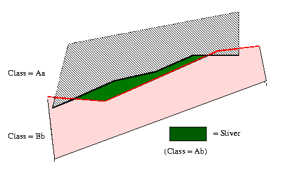

Geospatial data concepts
========================================================
Accuracy and precision


Geospatial data concepts
========================================================
Complex versus simple features

Sources of imprecision
- Measurement, recording and transcription errors
  - Have to clean the data
  - "Snapping" to reduced precision coordinates sometimes works
- Numerical imprecision
  - Floating point round-off and other effects
  - Snapping may help
  - Infinite precision arithmetic possible

  ***
  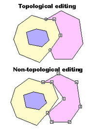

Geospatial data concepts
========================================================
Complex versus simple features


Most spatial operators in R require simple features

Geospatial data concepts
========================================================
Complex versus simple features


Most spatial operators in R require simple features

Geospatial data concepts
========================================================
type: sub-section
- Types of geospatial data
- Vectors and simple features
- Raster data
- Accuracy and precision
- **Map projections**
- Spatial indices

Geospatial data concepts
========================================================
Map projections

- Earth is not flat but we often treat geospatial data as being on a 2D plane
- Map projections translate points on the earth surface to a cartesian plane
- Acquired data may be in various (and sometimes undocumented!) spatial reference system
- Geometric distortions inherent in 2D data are not usually an issue in, for example, ecology, but is important in other fields like surveying

***


Geospatial data concepts
========================================================
Map projections

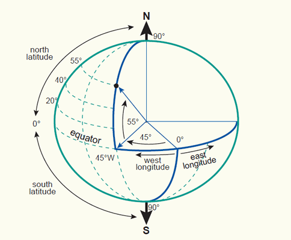

Latitude and longitude are natural coordinates

Geospatial data concepts
========================================================
Map projections

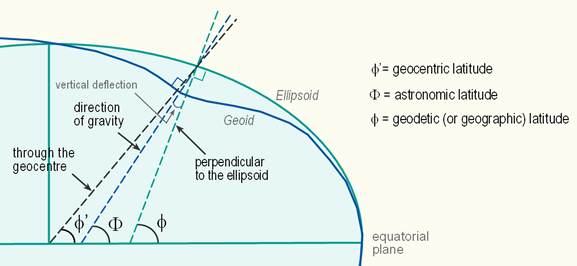

Nonetheless they are still relative to a model of earth

Geospatial data concepts
========================================================
Map projections

- Latitude, longitude are convenient but beware
- Software may assume cartesian coordinate system resulting in distortion of area and distance calculations
- Need to use geodesic or great-circle distances
- Especially at more local scales other cartesian projections are preferred

***


Geospatial data concepts
========================================================
Map projections


***

- Geodesic is shortest distance on the sphere
- Calculations on elipsoids and geoids is more complicated
- "Great circle" as it projects to a circle in traditional maps
- For very large distances, geodesic is better than euclidean

Geospatial data concepts
========================================================
Map projections


Geospatial data concepts
========================================================
Map projections

- Different projections create different types of distortions
- Common to work in geographical (lat-lon), equal-area and sometimes equidistant spatial reference systems
- Equal area preserves area but not angles
- Equidistant does not preserve distances for all pairs of locations
- Conformal preserves shapes
- Within small areas these distortions are small

***


Geospatial data concepts
========================================================
Example systems

- Latitude-longitude
- Equirectangular when projected to plane
- WGS84 and NAD83 most common systems
- Preserves distances along meridians
- Not equal-area or conformal
- Often used for global raster data

***


Geospatial data concepts
========================================================
Example coordinate systems

- Mercador and Transverse Mercador
- Conformal: preserves shapes locally
- Not equal area or equidistant
- Universal Transverse Mercador common and good for small regions

***

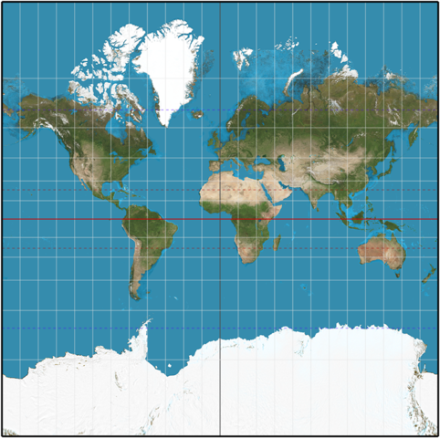

Geospatial data concepts
========================================================
Example coordinate systems

- Lambert's Azimuthal Equal Area
- Preserves area
- Not conformal or equidistant
- Used by US National Atlas
- In my field, many use an equal area projection and hope for the best
- Remember that distances and angles are not preserved

***

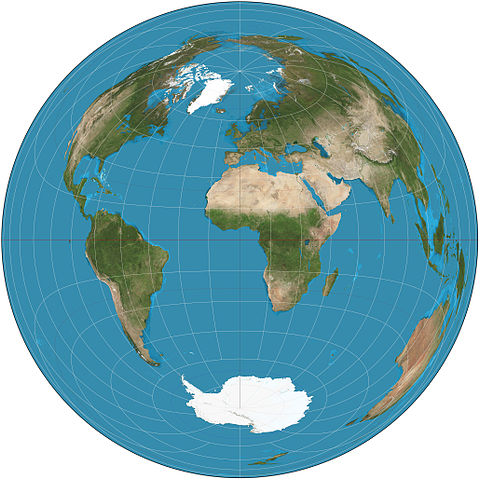

Geospatial data concepts
========================================================
type: sub-section
- Types of geospatial data
- Vectors and simple features
- Raster data
- Accuracy and precision
- Map projections
- **Spatial indices**

Geospatial data concepts
========================================================
Map queries

- Complex maps contain large number of object
- Example: what are all the public buildings within this rectangle?
- Want to avoid searching the entire database

***

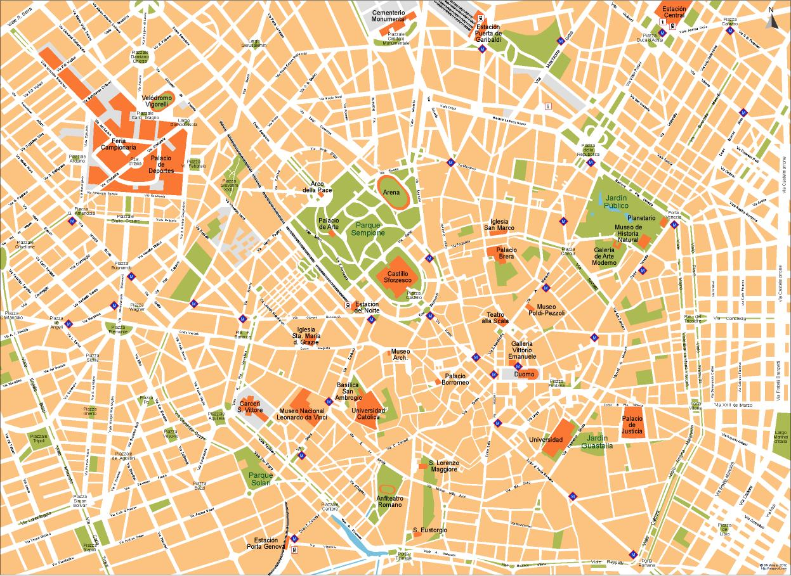

Geospatial data concepts
========================================================
Map queries

- Tree structures allow search in logarithmic time
- Left always smaller
- Right always larger

***


Geospatial data concepts
========================================================
Map queries

- R-Tree and derivatives do this in two dimensions
- Nested spatial hierarchy of rectangles
- Quickly extract all objects overlapping a region

***


Geospatial data concepts
========================================================
type: sub-section
- Types of geospatial data
- Vectors and simple features
- Raster data
- Accuracy and precision
- Map projections
- Spatial indices

RefresheR
========================================================
type: section

RefresheR
========================================================
type: sub-section
- **Getting started**
- Getting data in and out
- Basic syntax and control flow
- Vectorized expressions
- Array indices
- Functions and functional programming
- Lists and data frames
- Model syntax and S3 methods
- Model syntax and S4 methods
- Iterators and foreach
- Matrix-vector ops

RefresheR
========================================================

R interprets expressions

```r
x <- 3
print(x)
```

```
[1] 3
```

```r
y <- 2 * x + 4
print(y)
```

```
[1] 10
```

RefresheR
========================================================

Getting help


```r
help(ls)
?ls
??predict
help(package = stats)
```

Try googling "\<topic\> in R"

RefresheR
========================================================

Session environment


```r
library(nlme) # attach package
getwd() # where am I?
setwd("my.dir") # go there
ls() # list R objects
dir() # list files
q() # all done
```

RefresheR
========================================================
type: sub-section
- Getting started
- **Getting data in and out**
- Basic syntax and control flow
- Vectorized expressions
- Array indices
- Functions and functional programming
- Lists and data frames
- Model syntax and S3 methods
- Model syntax and S4 methods
- Iterators and foreach
- Matrix-vector ops

RefresheR
========================================================

Basic IO


```r
x <- readr::read_csv("the-data.csv") # 90% of what I do
x <- readr::read_delim("other-data.asc", header = TRUE, as.is = TRUE)
readr::write_csv(object, file = "output.csv")
```

These return data frames. More on that in a bit.

RefresheR
========================================================

Database access


```r
library(RPostgreSQL)
drv <- dbDriver("PostgreSQL")
con <- dbConnect(drv, dbname = "testing")
res <- dbSendQuery(con, "select length from coastlines")
dframe <- fetch(res)
```

Enables powerful SQL queries to RDMS. See also the `sqldf` package.

RefresheR
========================================================
type: sub-section
- Getting started
- Getting data in and out
- **Basic syntax and control flow**
- Vectorized expressions
- Array indices
- Functions and functional programming
- Lists and data frames
- Model syntax and S3 methods
- Model syntax and S4 methods
- Iterators and foreach
- Matrix-vector ops

RefresheR
========================================================

Assignment

```r
a = 1
b <- 2
3 -> c
print(a); print(b); print(c)
```

```
[1] 1
```

```
[1] 2
```

```
[1] 3
```

RefresheR
========================================================

Control flow (compact)

```r
if (TRUE) print("yes") else print("no")
```

```
[1] "yes"
```

```r
z <- rep(1, 10)
print(z)
```

```
 [1] 1 1 1 1 1 1 1 1 1 1
```

```r
for (i in 3:10) z[i] <- z[i - 1] + z[i - 2]
print(z)
```

```
 [1]  1  1  2  3  5  8 13 21 34 55
```
`if` and `for` are sufficient for the vast majority of programs

RefresheR
========================================================

Control flow (better layout)

```r
i <- 7
while (i) {
  z[i] <- z[i] / 2
  i <- i - 1
  if (i < 3) break
}
print(z) # divide elements 4:7 by 2
```

```
 [1]  1.0  1.0  1.0  1.5  2.5  4.0  6.5 21.0 34.0 55.0
```
`while` is less common but useful in cases with an indeterminate number of loops

RefresheR
========================================================

Control flow (better layout)

```r
i <- 7
while (i) {
  z[i] <- z[i] / 2
  i <- i - 1
  if (i < 3) break
}
```
- Use the ```styler``` package
- careful formatting is key to good code

RefresheR
========================================================
type: sub-section
- Getting started
- Getting data in and out
- Basic syntax and control flow
- **Vectorized expressions**
- Array indices
- Functions and functional programming
- Lists and data frames
- Model syntax and S3 methods
- Model syntax and S4 methods
- Iterators and foreach
- Matrix-vector ops

RefresheR
========================================================

R expressions are vectorized


```r
x <- 1:5
print(x)
```

```
[1] 1 2 3 4 5
```

```r
y <- 2 * x
print(y)
```

```
[1]  2  4  6  8 10
```

RefresheR
========================================================

The rule is that the expression is evaluated for each element


```r
z <- 1:5
print(2 * z)
```

```
[1]  2  4  6  8 10
```

```r
for (i in 1:5)
{
  z[i] <- 2 * z[i]
}
print(z)
```

```
[1]  2  4  6  8 10
```

RefresheR
========================================================

Functions may or may not return a value for each element of an input vector


```r
print(sqrt(1:5)) # a 'map'
```

```
[1] 1.000000 1.414214 1.732051 2.000000 2.236068
```

```r
print(sum(1:5)) # a 'reduce'
```

```
[1] 15
```

```r
print(summary(1:5)) # a more complex 'reduce'
```

```
   Min. 1st Qu.  Median    Mean 3rd Qu.    Max. 
      1       2       3       3       4       5 
```

Can be tricky in complex code

RefresheR
========================================================
type: sub-section
- Getting started
- Getting data in and out
- Basic syntax and control flow
- Vectorized expressions
- **Array indices**
- Functions and functional programming
- Lists and data frames
- Model syntax and S3 methods
- Model syntax and S4 methods
- Iterators and foreach
- Matrix-vector ops

RefresheR
========================================================

2-D indices are nested


```r
a <- matrix(1:9, 3)
print(a)
```

```
     [,1] [,2] [,3]
[1,]    1    4    7
[2,]    2    5    8
[3,]    3    6    9
```

```r
print(a[1:2, 3:2])
```

```
     [,1] [,2]
[1,]    7    4
[2,]    8    5
```

RefresheR
========================================================

2-D indices are nested


```r
b <- matrix(NA, 2, 2)
ri <- 1:2
ci <- 3:2
for (i in seq(along = ri)) # for each index in ri
  for (j in seq(along = ci)) # loop over indices in ci
    b[i, j] <- a[ri[i], ci[j]] # ith ri and jth ci
print(b)
```

```
     [,1] [,2]
[1,]    7    4
[2,]    8    5
```

```r
print(a[ri, ci]) # equivalent expression
```

```
     [,1] [,2]
[1,]    7    4
[2,]    8    5
```

You can omit braces for a single loop expression (not preferred)

RefresheR
========================================================

Rule is if no comma, then use each element of index


```r
print(a)
```

```
     [,1] [,2] [,3]
[1,]    1    4    7
[2,]    2    5    8
[3,]    3    6    9
```

```r
print(a[1:5]) # 1-D index gives 1-D result
```

```
[1] 1 2 3 4 5
```

Matrices are stored column-wise

RefresheR
========================================================

Index can be higher dimensional<small>

```r
i <- which(diag(3) == 1, arr.ind = TRUE)
print(i)
```

```
     row col
[1,]   1   1
[2,]   2   2
[3,]   3   3
```

```r
print(diag(a[i])) # a[i[1,]], a[i[2,]]...
```

```
     [,1] [,2] [,3]
[1,]    1    0    0
[2,]    0    5    0
[3,]    0    0    9
```

```r
print(a[i[, 1], i[, 2]]) # a[i[1, 1], i[1, 2]]...
```

```
     [,1] [,2] [,3]
[1,]    1    4    7
[2,]    2    5    8
[3,]    3    6    9
```
</small>

RefresheR
========================================================

Note the difference


```r
print(a[i])
```

```
[1] 1 5 9
```

```r
print(a[i[, 1], i[, 2]])
```

```
     [,1] [,2] [,3]
[1,]    1    4    7
[2,]    2    5    8
[3,]    3    6    9
```

Multiple indices separated by commas are nested

RefresheR
========================================================

Using indices creatively is often the fastest way to extract and rearrange data in R


```r
i <- rep(1:3, each = 2)
print(i)
```

```
[1] 1 1 2 2 3 3
```

```r
print(a[i, i])
```

```
     [,1] [,2] [,3] [,4] [,5] [,6]
[1,]    1    1    4    4    7    7
[2,]    1    1    4    4    7    7
[3,]    2    2    5    5    8    8
[4,]    2    2    5    5    8    8
[5,]    3    3    6    6    9    9
[6,]    3    3    6    6    9    9
```

RefresheR
========================================================

Using indices creatively is often the fastest way to extract and rearrange data in R


```r
i <- 1:3
print(sample(i))
```

```
[1] 2 1 3
```

```r
print(a[sample(i), sample(i)]) # row-column permutation
```

```
     [,1] [,2] [,3]
[1,]    3    9    6
[2,]    1    7    4
[3,]    2    8    5
```

RefresheR
========================================================
type: sub-section
- Getting started
- Getting data in and out
- Basic syntax and control flow
- Vectorized expressions
- Array indices
- **Functions and functional programming**
- Lists and data frames
- Model syntax and S3 methods
- Model syntax and S4 methods
- Iterators and foreach
- Matrix-vector ops

RefresheR
========================================================

Functions


```r
f <- function(a, b = 2, c = NULL) {
  res <- a * b
  if (!is.null(c)) res <- res * c
  return(res)
}
print(f(1, 2, 3))
```

```
[1] 6
```

```r
print(f(4))
```

```
[1] 8
```
Using `NULL` as a flag facilitates reuse

RefresheR
========================================================

Functions are objects


```r
print(class(f))
```

```
[1] "function"
```

```r
print(formals(f))
```

```
$a


$b
[1] 2

$c
NULL
```

RefresheR
========================================================

Functions are objects


```r
print(body(f))
```

```
{
    res <- a * b
    if (!is.null(c)) 
        res <- res * c
    return(res)
}
```

```r
body(f) = "gotcha"
print(f(6))
```

```
[1] "gotcha"
```

RefresheR
========================================================

Scope


```r
c <- "mice" # global
f <- function(a = "three") # function formals
{
  b <- "blind" # function body
  return(paste(a, b, c)) # three scopes
}
print(f())
```

```
[1] "three blind mice"
```
Object not found in current scope initiates search upward into enclosing scopes

RefresheR
========================================================

Scope


```r
x <- 2 # global scope
f <- function() x <- 2 * x # 2 different x's here
print(x)
```

```
[1] 2
```

```r
print(f())
```

```
[1] 4
```

```r
print(x)
```

```
[1] 2
```

The assignment in the function body creates a variable `x` whose scope is the function body

RefresheR
========================================================

Useful for closures


```r
f <- function() {
  x <- sum(rnorm(100)) # 1-time stuff here
  function(y) x * y # return a function
}
g <- f() # closure factory
print(c(g(2), f()(2))) # uses x created by f()
```

```
[1]  12.63737 -17.04116
```

The factory function is just a convenient way to bind an anonymous environment to the returned closure. I use this all the time to speed up calculations.

RefresheR
========================================================

Function objects and closures are the key to functional programming

Not functional


```r
x <- matrix(rnorm(25), 5)
row.sums <- rep(NA, 5)
for (i in 1:5) row.sums[i] <- sum(x[i, ])
print(row.sums)
```

```
[1]  2.78191863  0.02129104  0.72254189  0.81510978 -1.50976840
```

RefresheR
========================================================

Function objects and closures are the key to functional programming

Functional


```r
f <- function(i) sum(x[i, ]) # x global scope
row.sums <- sapply(1:5, f) # f(1), f(2)...
print(row.sums)
```

```
[1]  2.78191863  0.02129104  0.72254189  0.81510978 -1.50976840
```

- Note that variables are bound (copied to the function's environment) at the time of the function definition.
- Modifying the original variable in the global scope will not alter the closure.
- The `lapply` family of functions use C-level looping = fast
- I use this a lot

RefresheR
========================================================
type: sub-section
- Getting started
- Getting data in and out
- Basic syntax and control flow
- Vectorized expressions
- Array indices
- Functions and functional programming
- **Lists and data frames**
- Model syntax and S3 methods
- Model syntax and S4 methods
- Iterators and foreach
- Matrix-vector ops

RefresheR
========================================================

Arrays, including vectors and matrices, hold one type; lists hold different types


```r
# coerced to character
print(c(1, "a", TRUE))
```

```
[1] "1"    "a"    "TRUE"
```

```r
# retain individual types
print(list(1, "a", TRUE))
```

```
[[1]]
[1] 1

[[2]]
[1] "a"

[[3]]
[1] TRUE
```

RefresheR
========================================================

Single v. double braces


```r
x <- as.list(1:3)
print(x[2])
```

```
[[1]]
[1] 2
```

```r
print(class(x[2])) # returns list
```

```
[1] "list"
```

```r
print(x[[2]])
```

```
[1] 2
```

```r
print(class(x[[2]])) # returns list element
```

```
[1] "integer"
```

RefresheR
========================================================

Data frames are lists of vectors


```r
a <- 1:3
b <- factor(1:3)
c <- letters[1:3]
x <- data.frame(a = a, b = b, c = c)
print(x)
```

```
  a b c
1 1 1 a
2 2 2 b
3 3 3 c
```

```r
print(names(x))
```

```
[1] "a" "b" "c"
```

RefresheR
========================================================

Use list operators to extract columns


```r
print(x$a)
```

```
[1] 1 2 3
```

```r
print(x[[2]]) # a vector of factors
```

```
[1] 1 2 3
Levels: 1 2 3
```

```r
print(x[["c"]]) # different factors
```

```
[1] a b c
Levels: a b c
```

RefresheR
========================================================

Or matrix or vector indexing


```r
print(x[1:2, 2:3])
```

```
  b c
1 1 a
2 2 b
```

```r
print(x[2])
```

```
  b
1 1
2 2
3 3
```

RefresheR
========================================================

Subsetting


```r
y <- subset(x, b %in% 2:3, select = c(b, c))
print(y)
```

```
  b c
2 2 b
3 3 c
```

Lots of new fancy packages for manipulating data frames. See `reshape`, `plyr`, `dplyr`, `sqldf` and others.

RefresheR
========================================================
type: sub-section
- Getting started
- Getting data in and out
- Basic syntax and control flow
- Vectorized expressions
- Array indices
- Functions and functional programming
- Lists and data frames
- **Model syntax and S3 methods**
- Model syntax and S4 methods
- Iterators and foreach
- Matrix-vector ops

RefresheR
========================================================

*Raison d'être* of R is modeling <small>

```r
x <- rnorm(100)
y <- 1 + 2 * x + rnorm(100)
plot(y ~ x)
```

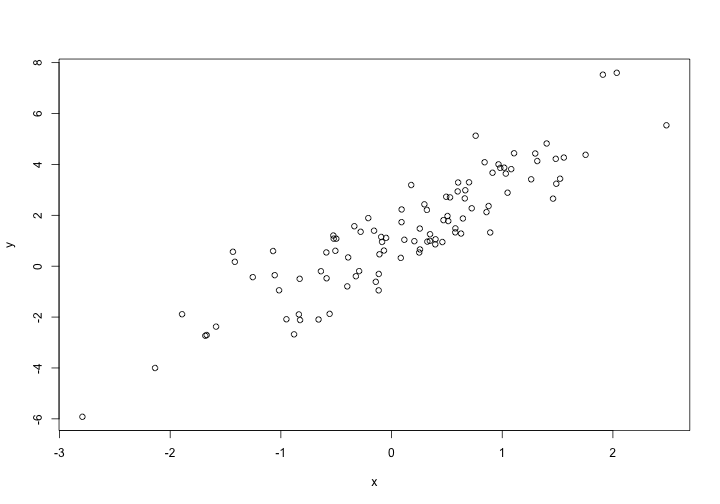
</small>

RefresheR
========================================================

*Raison d'être* of R is modeling <small>

```r
mod1 <- lm(y ~ x) # y = b0 + b1 * x
summary(mod1)
```

```

Call:
lm(formula = y ~ x)

Residuals:
    Min      1Q  Median      3Q     Max 
-1.8697 -0.8305 -0.1027  0.6841  2.5602 

Coefficients:
            Estimate Std. Error t value Pr(>|t|)    
(Intercept)   1.0810     0.1031   10.48   <2e-16 ***
x             2.1455     0.1061   20.22   <2e-16 ***
---
Signif. codes:  0 '***' 0.001 '**' 0.01 '*' 0.05 '.' 0.1 ' ' 1

Residual standard error: 1.019 on 98 degrees of freedom
Multiple R-squared:  0.8066,	Adjusted R-squared:  0.8047 
F-statistic: 408.8 on 1 and 98 DF,  p-value: < 2.2e-16
```
</small>

RefresheR
========================================================

S3 classes and methods

```r
print(class(mod1)) # S3 class
```

```
[1] "lm"
```

```r
methods(class = class(mod1)) # S3 methods
```

```
 [1] add1           alias          anova          case.names    
 [5] coerce         confint        cooks.distance deviance      
 [9] dfbeta         dfbetas        drop1          dummy.coef    
[13] effects        extractAIC     family         formula       
[17] fortify        hatvalues      influence      initialize    
[21] kappa          labels         logLik         model.frame   
[25] model.matrix   nobs           plot           predict       
[29] print          proj           qqnorm         qr            
[33] residuals      rstandard      rstudent       show          
[37] simulate       slotsFromS3    summary        variable.names
[41] vcov          
see '?methods' for accessing help and source code
```

RefresheR
========================================================

Calling a generic method

```r
plot(mod1)
```

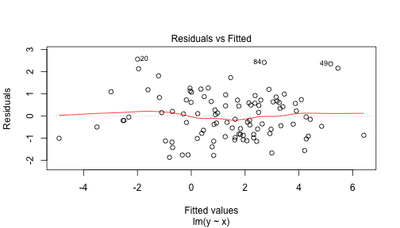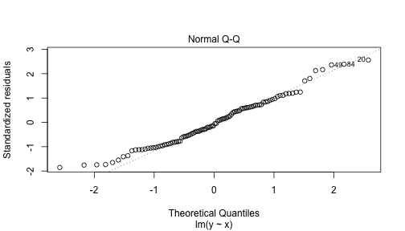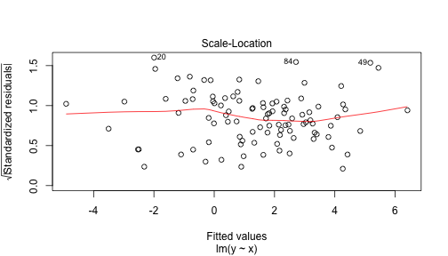

RefresheR
========================================================

*Raison d'être* of R is modeling

```r
anova(mod1)
```

```
Analysis of Variance Table

Response: y
          Df Sum Sq Mean Sq F value    Pr(>F)    
x          1 424.24  424.24  408.78 < 2.2e-16 ***
Residuals 98 101.70    1.04                      
---
Signif. codes:  0 '***' 0.001 '**' 0.01 '*' 0.05 '.' 0.1 ' ' 1
```
Model with `x` is much better

RefresheR
========================================================

Model syntax

```r
Y ~ X          # Y = B0 + B1 * X
Y ~ 0 + X      # Y = B1 * X
Y ~ X1 + X2    # Y = B0 + B1 * X1 + B2 * X2
Y ~ X1 * X2    # Y = B0 + B1 * X1 + B2 * X2 + B3 * X1 * X2
Y ~ I(X / 2)   # Y = B0 + B1 * (X / 2)
```
- `I` evaluates argument as a regular R expression

RefresheR
========================================================
Peaking under the hood
<small>

```r
str(mod1[1:6])
```

```
List of 6
 $ coefficients : Named num [1:2] 1.08 2.15
  ..- attr(*, "names")= chr [1:2] "(Intercept)" "x"
 $ residuals    : Named num [1:100] -0.5887 0.9836 -0.0448 -0.8709 0.4453 ...
  ..- attr(*, "names")= chr [1:100] "1" "2" "3" "4" ...
 $ effects      : Named num [1:100] -14.039 -20.597 -0.118 -1.043 0.487 ...
  ..- attr(*, "names")= chr [1:100] "(Intercept)" "x" "" "" ...
 $ rank         : int 2
 $ fitted.values: Named num [1:100] 2.46 3.46 4.26 6.41 1.77 ...
  ..- attr(*, "names")= chr [1:100] "1" "2" "3" "4" ...
 $ assign       : int [1:2] 0 1
```
</small>
- S3 objects are usually lists with a `class` attribute
- `str` can be helpful with "what the heck is that?"

RefresheR
========================================================
type: sub-section
- Getting started
- Getting data in and out
- Basic syntax and control flow
- Vectorized expressions
- Array indices
- Functions and functional programming
- Lists and data frames
- Model syntax and S3 methods
- **Model syntax and S4 methods**
- Iterators and foreach
- Matrix-vector ops

RefresheR
========================================================
Mixed effects with S4 classes $$Y = X \beta + Zu + \epsilon$$

```r
x <- rnorm(100)
z <- rbinom(100, 1, 0.5)
y <- 1 + 2 * x - 3 * z + rnorm(100)
```

RefresheR
========================================================
Mixed effects with S4 classes $$Y = X \beta + Zu + \epsilon$$

```r
xyz <- data_frame(x = x, y = y, z = z)
ggplot(xyz, aes(x, y)) + geom_point(color= "steelblue") + facet_wrap(~ z)
```

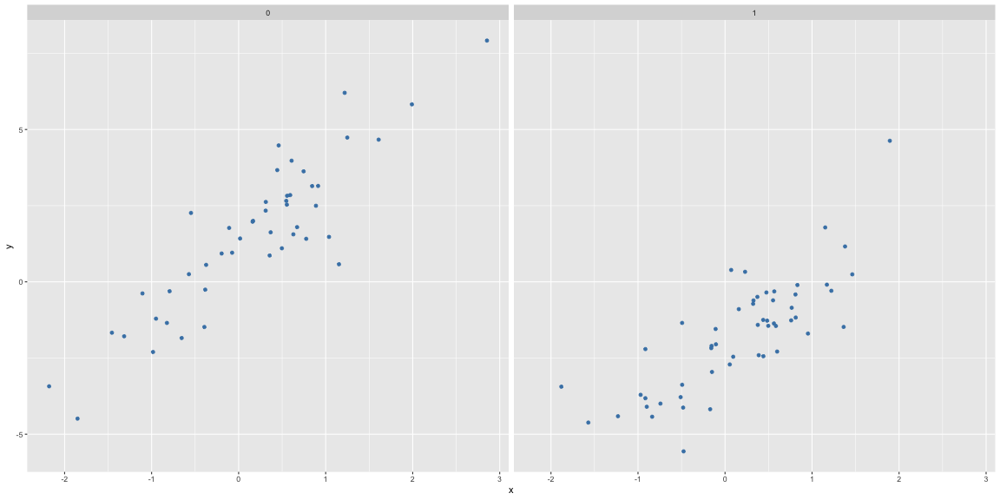

RefresheR
========================================================
Mixed effects with S4 classes $$Y = X \beta + Zu + \epsilon$$

```r
mod2 <- lme4::lmer(y ~ x + (1 | z)) # z is random intercept
print(mod2)
```

```
Linear mixed model fit by REML ['lmerMod']
Formula: y ~ x + (1 | z)
REML criterion at convergence: 316.6889
Random effects:
 Groups   Name        Std.Dev.
 z        (Intercept) 2.295   
 Residual             1.132   
Number of obs: 100, groups:  z, 2
Fixed Effects:
(Intercept)            x  
    -0.4485       2.1025  
```

RefresheR
========================================================
What is `mod2`?

```r
class(mod2)
```

```
[1] "lmerMod"
attr(,"package")
[1] "lme4"
```

```r
isS4(mod2)
```

```
[1] TRUE
```

RefresheR
========================================================
A generic method applied to S4 object

```r
ranef(mod2)
```

```
$z
  (Intercept)
0    1.619172
1   -1.619172
```
- Recall that `y` was constructed with `-3 * z`
- Correctly estimates random effect

RefresheR
========================================================
S4 object have slots

```r
slotNames(mod2)
```

```
 [1] "resp"    "Gp"      "call"    "frame"   "flist"   "cnms"    "lower"  
 [8] "theta"   "beta"    "u"       "devcomp" "pp"      "optinfo"
```

```r
show(mod2@beta)  # show is S4 print
```

```
[1] -0.4484536  2.1025154
```
Fixed effects stored in `beta`

RefresheR
========================================================
Access S4 slots with `@` or `slot` method

```r
head(mod2@frame, n = 3)  # the data
```

```
           y         x z
1 -0.1034333 0.8318085 1
2  3.1476881 0.9128802 0
3  1.5592438 0.6286287 0
```

```r
head(slot(mod2, 'frame'), n = 3)
```

```
           y         x z
1 -0.1034333 0.8318085 1
2  3.1476881 0.9128802 0
3  1.5592438 0.6286287 0
```
- It is bad design to ever access slots directly
- Better to treat slots as protected data
- Not all authors follow this rule

RefresheR
========================================================
type: sub-section
- Getting started
- Getting data in and out
- Basic syntax and control flow
- Vectorized expressions
- Array indices
- Functions and functional programming
- Lists and data frames
- Model syntax and S3 methods
- Model syntax and S4 methods
- **Iterators and foreach**
- Matrix-vector ops

RefresheR
========================================================
Iterators increment or decrement on each call rather than existing as a vector of values.


```r
library(iterators)
i <- iter(1:3)
c(nextElem(i), nextElem(i), nextElem(i))
```

```
[1] 1 2 3
```

Iterators can be convenient but really shine when they allow a computation to proceed incrementally without storing the entire iterator sequence in memory.

RefresheR
========================================================
`foreach` evaluates an expression for each value of an iterator sequence


```r
library(foreach)
foreach(i = 1:3) %do% rnorm(1)
```

```
[[1]]
[1] -0.56033

[[2]]
[1] 0.8289689

[[3]]
[1] 1.316551
```

The real action is in the `%do%` infix operator.

RefresheR
========================================================
The `.combine` argument gives more control


```r
library(foreach)
foreach(i = 1:3, .combine = c) %do% rnorm(1)
```

```
[1] 0.1965292 1.8581845 0.8693290
```

This is a form of map (the expression) and reduce (the .combine function)

RefresheR
========================================================
Something a bit more challenging


```r
f <- function(n = 1e7) prod(rnorm(n))
system.time(f())
```

```
   user  system elapsed 
  1.083   0.031   1.114 
```

About 1.5 seconds on my laptop

RefresheR
========================================================
Something a bit more challenging


```r
system.time(
  foreach(i = 1:5, .combine = prod) %do% f()
)
```

```
   user  system elapsed 
  4.700   0.042   4.743 
```

About 6.5 seconds on my laptop

RefresheR
========================================================
Now the really cool part


```r
library(doMC) # multicore extensions
registerDoMC() # create parallel engine
system.time(
  foreach(i = 1:5, .combine = prod) %dopar% f()
)
```

```
   user  system elapsed 
  0.015   0.020   1.671 
```

About 2.5 seconds on my laptop. Here `%dopar%` automatically splits the computation across all of the available cores.

RefresheR
========================================================
type: sub-section
- Getting started
- Getting data in and out
- Basic syntax and control flow
- Vectorized expressions
- Array indices
- Functions and functional programming
- Lists and data frames
- Model syntax and S3 methods
- Model syntax and S4 methods
- Iterators and foreach
- **Matrix-vector ops**

RefresheR
========================================================
R does linear algebra


```r
x <- 1:3 # [1, 2, 3]
x %*% x # inner product
```

```
     [,1]
[1,]   14
```

```r
x %*% t(x) # outer product
```

```
     [,1] [,2] [,3]
[1,]    1    2    3
[2,]    2    4    6
[3,]    3    6    9
```

RefresheR
========================================================
R does linear algebra


```r
a <- matrix(1:9, 3)
print(a)
```

```
     [,1] [,2] [,3]
[1,]    1    4    7
[2,]    2    5    8
[3,]    3    6    9
```

```r
a %*% x # matrix - vector product
```

```
     [,1]
[1,]   30
[2,]   36
[3,]   42
```

RefresheR
========================================================
R does linear algebra


```r
a %*% a # matrix - matrix product
```

```
     [,1] [,2] [,3]
[1,]   30   66  102
[2,]   36   81  126
[3,]   42   96  150
```

```r
eigen(a) # eigenvalue decomposition
```

```
eigen() decomposition
$values
[1]  1.611684e+01 -1.116844e+00 -5.700691e-16

$vectors
           [,1]       [,2]       [,3]
[1,] -0.4645473 -0.8829060  0.4082483
[2,] -0.5707955 -0.2395204 -0.8164966
[3,] -0.6770438  0.4038651  0.4082483
```

RefresheR
========================================================
R does linear algebra

- Offloaded to BLAS library so often quite efficient
- OpenBLAS (GotoBLAS) gives good performance
- Use matrix-vector computations whenever you have a multiply-accumulate problem
- Much faster than loops
- Limit is memory bandwidth for very large dense matrices
- Sparse matrices are available

RefresheR
========================================================
type: sub-section
- Getting started
- Getting data in and out
- Basic syntax and control flow
- Vectorized expressions
- Array indices
- Functions and functional programming
- Lists and data frames
- Model syntax and S3 methods
- Model syntax and S4 methods
- Iterators and foreach
- Matrix-vector ops
