Geospatial Data Analysis in R
========================================================
author: Timothy H. Keitt
date: May 29, 2019
width: 1440
height: 900

Working with vector data
========================================================
type: section

Working with vector data
========================================================
type: sub-section
- Simple features
- The `sf` package
- Vector data IO
- `sf` classes
- Creating vector data
- Plotting vector data
- Reprojecting data
- Geometry operators
- Geometry operators
- Basic point processes
- Interpolation and Kriging

Spatial layers
========================================================
GIS building blocks

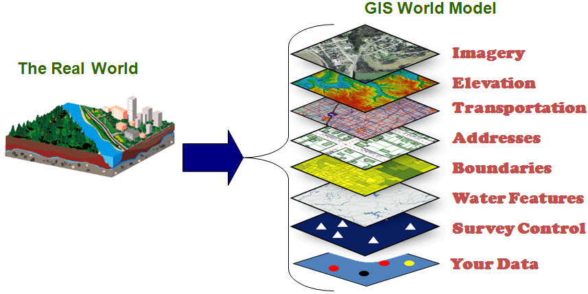

Working with vector data
========================================================
type: sub-section
- **Simple features**
- The `rgdal` package
- Vector data IO
- `sp` classes
- Creating vector data
- Plotting vector data
- Reprojecting data
- Geometry operators
- Geometry operators
- Basic point processes
- Interpolation and Kriging

Working with vector data
========================================================
OGC Simple Feature Hierarchy

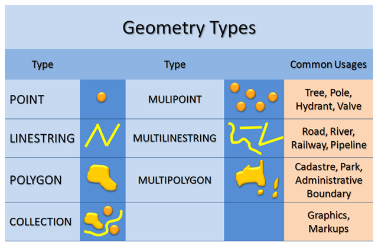

Working with vector data
========================================================
OGC Simple Feature Hierarchy


Working with vector data
========================================================
Complex versus simple features


Most spatial operators in R require simple features

Working with vector data
========================================================
Complex versus simple features

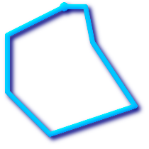


Most spatial operators in R require simple features

Working with vector data
========================================================
OGC Simple Features Well-Known-Text

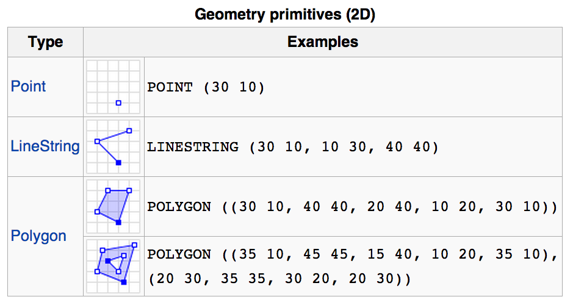

Working with vector data
========================================================
OGC Simple Features Well-Known-Text

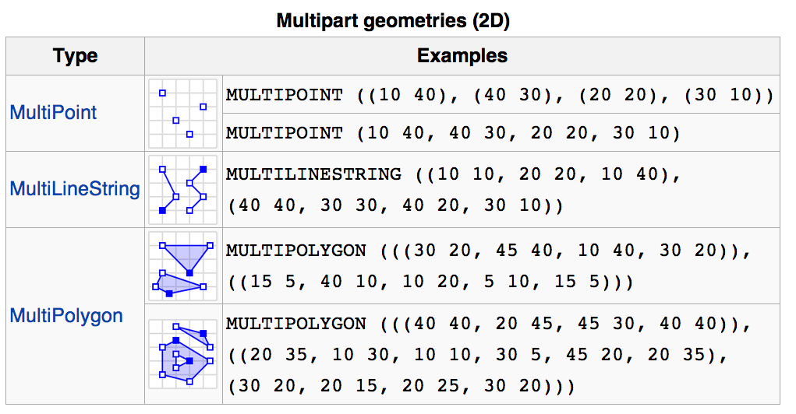

Working with vector data
========================================================
type: sub-section
- Simple features
- **The `sf` package**
- Vector data IO
- `sf` classes
- Creating vector data
- Plotting vector data
- Reprojecting data
- Geometry operators
- Geometry operators
- Basic point processes
- Interpolation and Kriging

Working with vector data
========================================================
sf package

- OGR component of GDAL handles vector data (http://www.gdal.org/)
- Data source -> data layer -> simple features
- Written in C++
- Like GDAL, large collection of runtime drivers
- Encapsulated in `sf` and experimental `rgdal2` packages
- With `sf` package, main use is to read data into `sf` classes

Working with vector data
========================================================
sf package


```r
library(sf)
st_drivers()$name
```

```
 [1] PCIDSK         netCDF         PDF            ESRI Shapefile
 [5] MapInfo File   UK .NTF        OGR_SDTS       S57           
 [9] DGN            OGR_VRT        REC            Memory        
[13] BNA            CSV            GML            GPX           
[17] KML            GeoJSON        OGR_GMT        GPKG          
[21] SQLite         WAsP           OpenFileGDB    XPlane        
[25] DXF            Geoconcept     GeoRSS         GPSTrackMaker 
[29] VFK            PGDUMP         OSM            GPSBabel      
[33] SUA            OpenAir        OGR_PDS        WFS           
[37] HTF            AeronavFAA     EDIGEO         GFT           
[41] SVG            CouchDB        Cloudant       Idrisi        
[45] ARCGEN         SEGUKOOA       SEGY           ODS           
[49] XLSX           ElasticSearch  Carto          AmigoCloud    
[53] SXF            Selafin        JML            PLSCENES      
[57] CSW            VDV            TIGER          AVCBin        
[61] AVCE00         HTTP          
180 Levels: AAIGrid ACE2 ADRG AeronavFAA AIG AirSAR AmigoCloud ... ZMap
```

Uniform access to many data sources

Working with vector data
========================================================
type: sub-section
- Simple features
- The `rgdal` package
- **Vector data IO**
- `sp` classes
- Creating vector data
- Plotting vector data
- Reprojecting data
- Geometry operators
- Geometry operators
- Basic point processes
- Interpolation and Kriging

Working with vector data
========================================================
Vector data IO

- main functions
  - st_read
  - st_write


```r
vecdat = st_read("example-data/continents", "continent")
```

```
Reading layer `continent' from data source `/Users/tkeitt/Dropbox/R/keitt.ssi.2019/inst/materials/lectures/example-data/continents' using driver `ESRI Shapefile'
Simple feature collection with 8 features and 1 field
geometry type:  MULTIPOLYGON
dimension:      XY
bbox:           xmin: -180 ymin: -90 xmax: 180 ymax: 83.6022
epsg (SRID):    4326
proj4string:    +proj=longlat +datum=WGS84 +no_defs
```
First argument (`dsn`) is the data source. The second argument is the layer within the data source.

Working with vector data
========================================================
Vector data IO

An ESRI shapefile is often several files stored together in a directory. The directory is the data source and the `.shp` file is the layer. Other files hold spatial reference system and tabular field data.

```r
dir("example-data")              # see the data source
```

```
[1] "continents"     "NCEAS sample"   "ozone.gml"      "ozone.xsd"     
[5] "rainforest"     "rainforest.tif"
```

```r
dir("example-data/continents")   # see the data layers
```

```
[1] "continent.dbf" "continent.prj" "continent.shp" "continent.shx"
```
Other formats are single file, in which case the data source is the file name and the layer is named within the file, typically the same as the file name without the extension.

Working with vector data
========================================================
Vector data IO

- Layers are always named and numbered within the data source
- Data sources can be directories containing files for the different layers or can be single files
- Data source can also be a relational database system or web service capable of providing simple features

```r
library(RPostgreSQL)
conn = dbConnect(PostgreSQL(), dbname = "test")
vecdat = st_read_db(conn, table = "postgis_table") # not run
dbDisconnect(conn)
```
This example would load the simple features and associated attribute columns from a PostGIS (http://www.postgis.org) table stored in a PostgreSQL database (http://www.postgresql.org).

Working with vector data
========================================================
Vector data IO


```r
ggplot(vecdat) + geom_sf(color = "lightblue") + theme_bw()
```

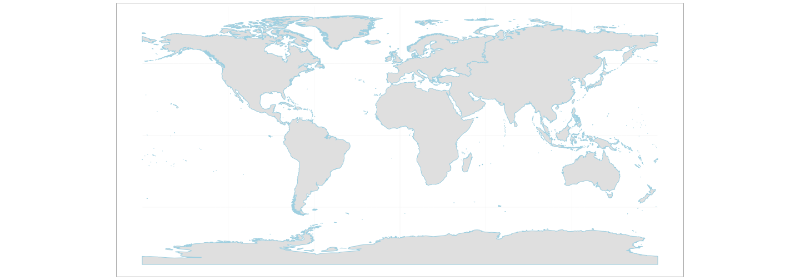

Working with vector data
========================================================
Vector data IO

`st_write` does the opposite

```r
dest = tempdir()
st_write(vecdat, dest, "newlayername", driver = "ESRI Shapefile")
```

```
Writing layer `newlayername' to data source `/var/folders/rd/vbxgtfr542l9w47nmfynknnh0000gn/T//RtmpW6UJIJ' using driver `ESRI Shapefile'
features:       8
fields:         1
geometry type:  Multi Polygon
```

```r
dir(dest)
```

```
[1] "file6d5d6ec038b"  "newlayername.dbf" "newlayername.prj"
[4] "newlayername.shp" "newlayername.shx"
```

```r
unlink(dest)  # remove the output
```

Working with vector data
========================================================
type: sub-section
- Simple features
- The `rgdal` package
- Vector data IO
- **`sf` classes**
- Creating vector data
- Plotting vector data
- Reprojecting data
- Geometry operators
- Geometry operators
- Basic point processes
- Interpolation and Kriging

Working with vector data
========================================================
`sp` classes

```r
class(vecdat)       # sf class: help(package=sf)
```

```
[1] "sf"         "data.frame"
```

```r
str(vecdat)
```

```
Classes 'sf' and 'data.frame':	8 obs. of  2 variables:
 $ CONTINENT: Factor w/ 8 levels "Africa","Antarctica",..: 3 6 5 1 8 7 4 2
 $ geometry :sfc_MULTIPOLYGON of length 8; first list element: List of 487
  ..$ :List of 1
  .. ..$ : num [1:24, 1:2] 93.3 93.1 91.4 92.6 91.9 ...
  ..$ :List of 1
  .. ..$ : num [1:5, 1:2] 91 90 89.9 91.6 91 ...
  ..$ :List of 1
  .. ..$ : num [1:5, 1:2] 79.2 79.7 80.4 79 79.2 ...
  ..$ :List of 1
  .. ..$ : num [1:26, 1:2] 99.6 99 99.9 98.3 95.5 ...
  ..$ :List of 1
  .. ..$ : num [1:10, 1:2] 91.1 90.9 92.9 93.8 93 ...
  ..$ :List of 1
  .. ..$ : num [1:5, 1:2] 94 94.3 94.3 93.9 94 ...
  ..$ :List of 1
  .. ..$ : num [1:5, 1:2] 91.6 91.2 91.1 91.9 91.6 ...
  ..$ :List of 1
  .. ..$ : num [1:5, 1:2] 99.9 99.9 100.3 100 99.9 ...
  ..$ :List of 1
  .. ..$ : num [1:5, 1:2] 76.6 76.2 76 77.6 76.6 ...
  ..$ :List of 1
  .. ..$ : num [1:5, 1:2] 91.8 92.3 92.5 92.2 91.8 ...
  ..$ :List of 1
  .. ..$ : num [1:5, 1:2] 92.6 92.8 93 92.7 92.6 ...
  ..$ :List of 1
  .. ..$ : num [1:24, 1:2] 105.3 102.7 99.3 100 100.4 ...
  ..$ :List of 1
  .. ..$ : num [1:5, 1:2] 106 106 107 107 106 ...
  ..$ :List of 1
  .. ..$ : num [1:5, 1:2] 93.7 93.6 93.5 93.6 93.7 ...
  ..$ :List of 1
  .. ..$ : num [1:5, 1:2] 107 106 106 108 107 ...
  ..$ :List of 1
  .. ..$ : num [1:1775, 1:2] 57.2 57 56.8 56.1 54.8 ...
  ..$ :List of 1
  .. ..$ : num [1:5, 1:2] 91.9 91.8 91.7 92 91.9 ...
  ..$ :List of 1
  .. ..$ : num [1:5, 1:2] 82.2 82.4 82.6 82.1 82.2 ...
  ..$ :List of 1
  .. ..$ : num [1:5, 1:2] 107 107 107 107 107 ...
  ..$ :List of 1
  .. ..$ : num [1:5, 1:2] 107 107 107 108 107 ...
  ..$ :List of 1
  .. ..$ : num [1:5, 1:2] 89.2 89.1 89.3 89.7 89.2 ...
  ..$ :List of 1
  .. ..$ : num [1:5, 1:2] 96.5 96.2 95.2 95.6 96.5 ...
  ..$ :List of 1
  .. ..$ : num [1:7, 1:2] 88.9 88.6 88.8 88.6 88.7 ...
  ..$ :List of 1
  .. ..$ : num [1:5, 1:2] 156 157 157 156 156 ...
  ..$ :List of 1
  .. ..$ : num [1:5, 1:2] 96.3 96.2 95.9 96.2 96.3 ...
  ..$ :List of 1
  .. ..$ : num [1:5, 1:2] 97.9 97.7 97.7 97.9 97.9 ...
  ..$ :List of 1
  .. ..$ : num [1:5, 1:2] 97.4 97.4 97.1 97.6 97.4 ...
  ..$ :List of 1
  .. ..$ : num [1:5, 1:2] 148 149 149 149 148 ...
  ..$ :List of 1
  .. ..$ : num [1:4, 1:2] 97.5 97.3 97.4 97.5 76.6 ...
  ..$ :List of 1
  .. ..$ : num [1:5, 1:2] 95.6 95.8 95.5 95.4 95.6 ...
  ..$ :List of 1
  .. ..$ : num [1:5, 1:2] 95.1 95.3 94.8 95.1 95.1 ...
  ..$ :List of 1
  .. ..$ : num [1:5, 1:2] 96.5 96.2 95.9 96 96.5 ...
  ..$ :List of 1
  .. ..$ : num [1:6, 1:2] 113 112 112 113 113 ...
  ..$ :List of 1
  .. ..$ : num [1:5, 1:2] 94 94.3 94.4 93.9 94 ...
  ..$ :List of 1
  .. ..$ : num [1:5, 1:2] 113 113 113 113 113 ...
  ..$ :List of 1
  .. ..$ : num [1:6, 1:2] 96.8 96.8 97.1 96.9 97 ...
  ..$ :List of 1
  .. ..$ : num [1:9, 1:2] 96.4 96.2 95.3 95.3 96.3 ...
  ..$ :List of 1
  .. ..$ : num [1:5, 1:2] 94.8 95 94.8 94.4 94.8 ...
  ..$ :List of 1
  .. ..$ : num [1:42, 1:2] 145 145 145 144 143 ...
  ..$ :List of 1
  .. ..$ : num [1:5, 1:2] 153 152 153 153 153 ...
  ..$ :List of 1
  .. ..$ : num [1:5, 1:2] 141 141 141 141 141 ...
  ..$ :List of 1
  .. ..$ : num [1:5, 1:2] 97.3 97 96.7 96.8 97.3 ...
  ..$ :List of 1
  .. ..$ : num [1:5, 1:2] 82.9 82.8 82.3 83.3 82.9 ...
  ..$ :List of 1
  .. ..$ : num [1:5, 1:2] 81.6 82.3 82.3 81.6 81.6 ...
  ..$ :List of 1
  .. ..$ : num [1:5, 1:2] 135 136 136 136 135 ...
  ..$ :List of 1
  .. ..$ : num [1:5, 1:2] 141 141 141 141 141 ...
  ..$ :List of 1
  .. ..$ : num [1:12, 1:2] 147 147 148 149 148 ...
  ..$ :List of 1
  .. ..$ : num [1:7, 1:2] 82.2 82 82.3 82 82 ...
  ..$ :List of 1
  .. ..$ : num [1:6, 1:2] 87 87.1 86.7 86.8 86.2 ...
  ..$ :List of 1
  .. ..$ : num [1:5, 1:2] 86.5 86.7 86.8 86.6 86.5 ...
  ..$ :List of 1
  .. ..$ : num [1:5, 1:2] 85.5 85.7 85.1 85.3 85.5 ...
  ..$ :List of 1
  .. ..$ : num [1:5, 1:2] 79.2 79.3 79.6 79.5 79.2 ...
  ..$ :List of 1
  .. ..$ : num [1:5, 1:2] 85.6 85.4 85.1 85.3 85.6 ...
  ..$ :List of 1
  .. ..$ : num [1:5, 1:2] 85.9 85.7 85.8 86.2 85.9 ...
  ..$ :List of 1
  .. ..$ : num [1:7, 1:2] 113 112 111 112 112 ...
  ..$ :List of 1
  .. ..$ : num [1:5, 1:2] 84.7 84.9 84.4 84.4 84.7 ...
  ..$ :List of 1
  .. ..$ : num [1:5, 1:2] 85.2 85.5 85.6 85.4 85.2 ...
  ..$ :List of 1
  .. ..$ : num [1:5, 1:2] 116 116 116 116 116 ...
  ..$ :List of 1
  .. ..$ : num [1:7, 1:2] 140 140 140 141 141 ...
  ..$ :List of 1
  .. ..$ : num [1:5, 1:2] 135 136 136 136 135 ...
  ..$ :List of 1
  .. ..$ : num [1:5, 1:2] 82.6 82.7 82.3 82.4 82.6 ...
  ..$ :List of 1
  .. ..$ : num [1:5, 1:2] 82.8 83.2 83.6 83.4 82.8 ...
  ..$ :List of 1
  .. ..$ : num [1:5, 1:2] 84 84.4 84.4 83.9 84 ...
  ..$ :List of 1
  .. ..$ : num [1:5, 1:2] 125 124 124 125 125 ...
  ..$ :List of 1
  .. ..$ : num [1:7, 1:2] 141 143 143 144 140 ...
  ..$ :List of 1
  .. ..$ : num [1:5, 1:2] 86.9 87.2 87.3 87.1 86.9 ...
  ..$ :List of 1
  .. ..$ : num [1:23, 1:2] 124 123 123 124 124 ...
  ..$ :List of 1
  .. ..$ : num [1:5, 1:2] 86.9 86.7 86.4 86.5 86.9 ...
  ..$ :List of 1
  .. ..$ : num [1:5, 1:2] 126 126 126 126 126 ...
  ..$ :List of 1
  .. ..$ : num [1:5, 1:2] 80.3 80.1 80.1 80.4 80.3 ...
  ..$ :List of 1
  .. ..$ : num [1:5, 1:2] 75.3 75.6 76.1 75.9 75.3 ...
  ..$ :List of 1
  .. ..$ : num [1:5, 1:2] 76.1 76.2 76.7 76.8 76.1 ...
  ..$ :List of 1
  .. ..$ : num [1:5, 1:2] 127 128 128 128 127 ...
  ..$ :List of 1
  .. ..$ : num [1:15, 1:2] 127 127 127 128 128 ...
  ..$ :List of 1
  .. ..$ : num [1:10, 1:2] 69.9 70.1 70 70.5 71.2 ...
  ..$ :List of 1
  .. ..$ : num [1:5, 1:2] 126 126 127 127 126 ...
  ..$ :List of 1
  .. ..$ : num [1:5, 1:2] 71.1 71.2 71.4 71.2 71.1 ...
  ..$ :List of 1
  .. ..$ : num [1:5, 1:2] 76.2 76.1 76.7 76.5 76.2 ...
  ..$ :List of 1
  .. ..$ : num [1:5, 1:2] 120 120 120 120 120 ...
  ..$ :List of 1
  .. ..$ : num [1:7, 1:2] 74.1 74.4 74.9 75 74.7 ...
  ..$ :List of 1
  .. ..$ : num [1:5, 1:2] 78.7 79.2 79.6 78.6 78.7 ...
  ..$ :List of 1
  .. ..$ : num [1:5, 1:2] 122 122 122 122 122 ...
  ..$ :List of 1
  .. ..$ : num [1:5, 1:2] 129 129 129 129 129 ...
  ..$ :List of 1
  .. ..$ : num [1:5, 1:2] 122 123 124 123 122 ...
  ..$ :List of 1
  .. ..$ : num [1:5, 1:2] 129 128 128 129 129 ...
  ..$ :List of 1
  .. ..$ : num [1:6, 1:2] 127 128 129 129 129 ...
  ..$ :List of 1
  .. ..$ : num [1:5, 1:2] 128 129 129 129 128 ...
  ..$ :List of 1
  .. ..$ : num [1:10, 1:2] 127 128 129 129 129 ...
  ..$ :List of 1
  .. ..$ : num [1:5, 1:2] 76.9 77.6 78.4 77.8 76.9 ...
  ..$ :List of 1
  .. ..$ : num [1:5, 1:2] 127 127 127 127 127 ...
  ..$ :List of 1
  .. ..$ : num [1:5, 1:2] 127 127 127 127 127 ...
  ..$ :List of 1
  .. ..$ : num [1:5, 1:2] 138 138 139 139 138 ...
  ..$ :List of 1
  .. ..$ : num [1:8, 1:2] -180 -180 -180 -179 -177 ...
  ..$ :List of 1
  .. ..$ : num [1:5, 1:2] 138 138 137 138 138 ...
  ..$ :List of 1
  .. ..$ : num [1:5, 1:2] 180 180 179 179 180 ...
  ..$ :List of 1
  .. ..$ : num [1:5, 1:2] 82.4 82.3 82.5 82.4 82.4 ...
  ..$ :List of 1
  .. ..$ : num [1:5, 1:2] 83.2 83.1 83.1 83.3 83.2 ...
  ..$ :List of 1
  .. ..$ : num [1:5, 1:2] 161 160 160 161 161 ...
  ..$ :List of 1
  .. ..$ : num [1:6, 1:2] 83.1 83.2 83.5 83.3 83.3 ...
  .. [list output truncated]
  ..- attr(*, "class")= chr  "XY" "MULTIPOLYGON" "sfg"
 - attr(*, "sf_column")= chr "geometry"
 - attr(*, "agr")= Factor w/ 3 levels "constant","aggregate",..: NA
  ..- attr(*, "names")= chr "CONTINENT"
```

Working with vector data
========================================================
`sf` classes

Classes

Type  | Description
------------- | -------------
`POINT` | zero-dimensional geometry containing a single point
`LINESTRING`  | sequence of points connected by straight, non-self intersecting line pieces; one-dimensional geometry
`POLYGON` | geometry with a positive area (two-dimensional); sequence of points form a closed, non-self intersecting ring; the first ring denotes the exterior ring, zero or more subsequent rings denote holes in this exterior ring

Also `MULTI` versions of these.

Working with vector data
========================================================
type: sub-section
- Simple features
- The `rgdal` package
- Vector data IO
- `sp` classes
- **Creating vector data**
- Plotting vector data
- Reprojecting data
- Geometry operators
- Geometry operators
- Basic point processes
- Interpolation and Kriging

Working with vector data
========================================================
Creating vector data


```r
loc = rbind(c(30.25, 97.75), c(42.36, 71.06),
            c(41.88, 87.63), c(37.78, 122.42),
            c(30.25, 97.75))
loc = cbind(-loc[,2], loc[,1])
show(loc)
```

```
        [,1]  [,2]
[1,]  -97.75 30.25
[2,]  -71.06 42.36
[3,]  -87.63 41.88
[4,] -122.42 37.78
[5,]  -97.75 30.25
```

Working with vector data
========================================================
Creating vector data


```r
places = data.frame(longitude = loc[1:4, 1],
                    latitude = loc[1:4, 2],
                    cities = c("Austin", "Boston",
                               "Chicago", "Los Angeles"))
places.sf <- st_as_sf(places, coords = c("longitude", "latitude"), crs = 4326) # WGS 84
show(class(places.sf))
```

```
[1] "sf"         "data.frame"
```

```r
show(places)
```

```
  longitude latitude      cities
1    -97.75    30.25      Austin
2    -71.06    42.36      Boston
3    -87.63    41.88     Chicago
4   -122.42    37.78 Los Angeles
```

Working with vector data
========================================================
Creating vector data


```r
na = subset(vecdat, CONTINENT == "North America")
ggplot(na) + geom_sf() + xlim(-150, -30) +
  geom_sf(data = places.sf, color = "steelblue", size = 6)
```

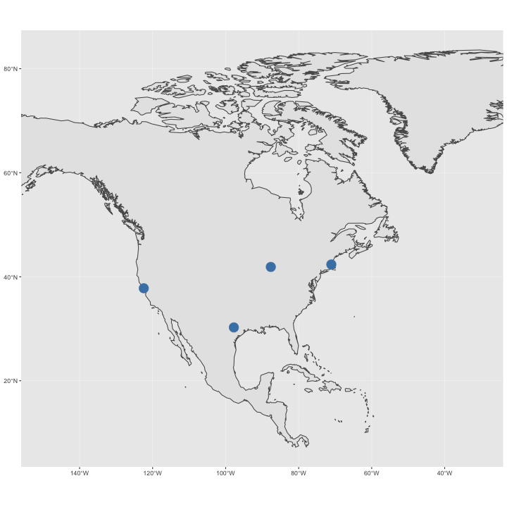

Working with vector data
========================================================
Creating vector data

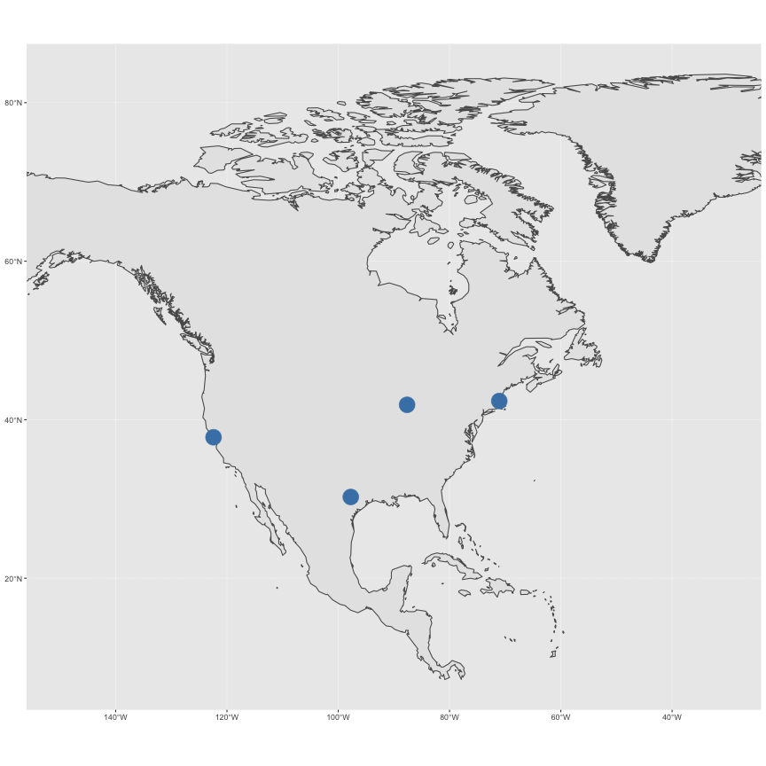

Working with vector data
========================================================
Creating vector data


```r
spoly <- st_polygon(list(loc))
show(spoly)
```

Working with vector data
========================================================
Creating vector data


```r
loc <- data.frame(x = loc[, 1], y = loc[, 2])
ggplot(na) + geom_sf(fill = "navajowhite") + xlim(-150, -30) +
  geom_polygon(aes(x, y), data = loc, fill = "lightblue") +
  geom_sf(data = places.sf, color = "darkgreen", size = 6)
```


Working with vector data
========================================================
type: sub-section
- Simple features
- The `rgdal` package
- Vector data IO
- `sp` classes
- Creating vector data
- **Plotting vector data**
- Reprojecting data
- Geometry operators
- Geometry operators
- Basic point processes
- Interpolation and Kriging

Working with vector data
========================================================
Plotting vector data

- Several different systems
- Base graphics
  - `plot`, `points`, `lines`, `polygons`
- Grid graphics
  - Low-level
  - Base for lattice and ggplot2
- Lattice
  - `xyplot`, `spplot`
- Ggplot2
  - `qplot`, `ggplot`
  - Lots of folks moving to this

Working with vector data
========================================================
Plotting vector data

The `plot` command is specialized for `sp` classes and will generally do the right thing. A few switches:

- `type` -- one of `p, l, o, n` (points, lines, points-lines, suppress output)
- `add` -- if `TRUE` then overlay on current plot
- `cex` -- symbol magnification factor
- `lwd` -- line width
- `col` -- the color to use (many ways to specify; see `rgb`)
- `bg` -- the background or fill color
- `xpd` -- if set to `NA` will supress clipping at plot borders
- `pch` -- symbol for points (21 = filled circle)

Working with vector data
========================================================
type: sub-section
- Simple features
- The `rgdal` package
- Vector data IO
- `sp` classes
- Creating vector data
- Plotting vector data
- **Reprojecting data**
- Geometry operators
- Basic point processes
- Interpolation and Kriging

Working with vector data
========================================================
Reprojecting data


Working with vector data
========================================================
Reprojecting data


```r
p4s = "+proj=laea +lat_0=45 +lon_0=-100 +x_0=0 +y_0=0 +a=6370997 +b=6370997 +units=m +no_defs" # US National Atlas
loc.sf <- st_as_sf(loc, coords = c("x", "y"))
st_crs(loc.sf) <- 4326
na.laea = st_transform(na, p4s)
loc.laea = st_transform(loc.sf, p4s)
places.laea = st_transform(places.sf, p4s)
show(loc.laea)
```

```
Simple feature collection with 5 features and 0 fields
geometry type:  POINT
dimension:      XY
bbox:           xmin: -1945033 ymin: -1632769 xmax: 2316751 ymax: 124310.3
epsg (SRID):    NA
proj4string:    +proj=laea +lat_0=45 +lon_0=-100 +x_0=0 +y_0=0 +a=6370997 +b=6370997 +units=m +no_defs
                   geometry
1 POINT (217894.6 -1632769)
2  POINT (2316751 124310.3)
3 POINT (1019669 -269814.5)
4  POINT (-1945033 -538365)
5 POINT (217894.6 -1632769)
```

Working with vector data
========================================================
Reprojecting data


Working with vector data
========================================================
Reprojecting data

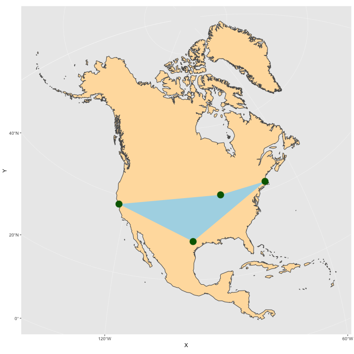

Working with vector data
========================================================
Reprojecting data

- Based on PROJ4 software, see http://trac.osgeo.org/proj/
- Look up `proj4string` at: http://spatialreference.org/
- Large libraries of "canned" definitions
  - European Petroleum Survey Group (EPSG)
  - ESRI
  - International Astronomical Union (IAU)
- These define parameters, units, earth model, etc.

Working with vector data
========================================================
type: sub-section
- Simple features
- The `rgdal` package
- Vector data IO
- `sp` classes
- Creating vector data
- Plotting vector data
- Reprojecting data
- **Geometry operators**
- Basic point processes
- Interpolation and Kriging

Working with vector data
========================================================
Geometry operators

GEOS Library

- Wrapper for the Geometry Engine - Open Source
- C++ port of Java Topology Suite
- Used by PostGIS for geometry operations
- Also exposed by GDAL and `sf` library

Working with vector data
========================================================
Geometry operators

Uses simple features

  - POINT
  - LINESTRING
  - POLYGON
  - MULTIPOINT
  - MULTILINESTRING
  - MULTIPOLYGON
  - GEOMETRYCOLLECTION

stored in `sf` classes

Working with vector data
========================================================
Geometry operators

Read in `sp` objecst using `rgdal` or other software or construct from WKT


```r
p1 = st_as_sfc("POINT(-97.75 30.25)")
st_crs(p1) <- "+proj=longlat +ellps=WGS84"
show(p1)
```

```
Geometry set for 1 feature 
geometry type:  POINT
dimension:      XY
bbox:           xmin: -97.75 ymin: 30.25 xmax: -97.75 ymax: 30.25
epsg (SRID):    4326
proj4string:    +proj=longlat +ellps=WGS84 +no_defs
```

```r
st_as_text(p1)
```

```
[1] "POINT (-97.75 30.25)"
```

Working with vector data
========================================================
Geometry operators


```r
p2 <- st_as_sfc("POINT(-71.06 42.36)")
st_crs(p2) <- "+proj=longlat +ellps=WGS84"
st_distance(p1, p2) # understands CRS
```

```
Units: [m]
        [,1]
[1,] 2731121
```

```r
gc = SpatialPoints(greatCircle(as(p1, "Spatial"), as(p2, "Spatial")), proj = CRS("+proj=longlat +ellps=WGS84"))
```

Working with vector data
========================================================
Geometry operators


```r
ggplot(na) + geom_sf(fill = "navajowhite") + xlim(-150, -30) +
  geom_sf(data = as(gc, "sf"), color = "lightblue", size = 2) + ylim(10, 80) +
  geom_sf(data = places.sf, color = "darkgreen", size = 6)
```

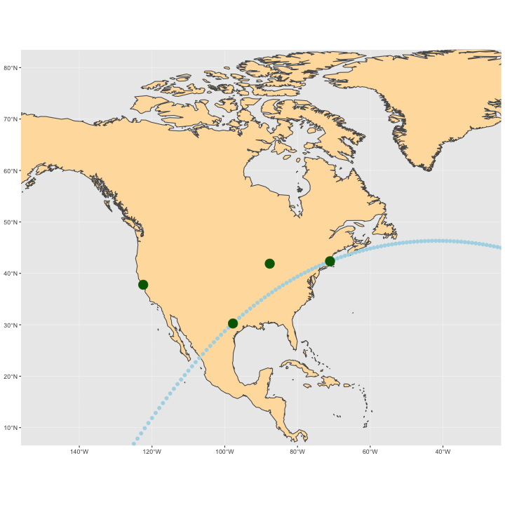

Working with vector data
========================================================
type: sub-section
- Simple features
- The `rgdal` package
- Vector data IO
- `sp` classes
- Creating vector data
- Plotting vector data
- Reprojecting data
- Geometry operators
- **Geometry operators**
- Basic point processes
- Interpolation and Kriging

Working with vector data
========================================================
Geometry operators

Spatial sets


Working with vector data
========================================================


Working with vector data
========================================================
Geometry operators

Spatial sets


Working with vector data
========================================================
Geometry operators


```r
sp1 = st_as_sfc("POLYGON ((10 10, 15 0, 25 0, 30 10, 25 20, 15 20, 10 10))")
sp2 = st_as_sfc("POLYGON ((20 10, 30 0, 40 10, 30 20, 20 10))")
st_union(sp1, sp2) %>%
  ggplot() + geom_sf() +
  geom_sf(data = sp1, fill = "lightblue") +
  geom_sf(data = sp2, fill = "lightgreen") +
  geom_sf(data = st_intersection(sp1, sp2), fill = "lightyellow") +
  theme_bw()
```

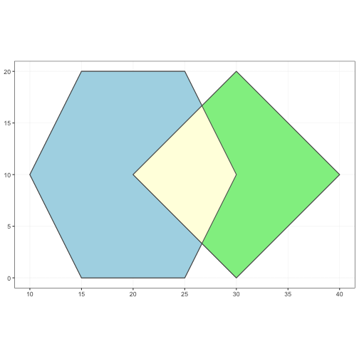

Working with vector data
========================================================
Geometry operators


```r
rel = st_relate(sp1, sp2); show(rel)
```

```
     [,1]       
[1,] "212101212"
```

```r
mat = matrix(unlist(strsplit(rel, "")), 3)
typ = c("interior", "boundary", "exterior")
dimnames(mat) = list(typ, typ)
mode(mat) = "numeric"; show(mat)
```

```
         interior boundary exterior
interior        2        1        2
boundary        1        0        1
exterior        2        1        2
```

Working with vector data
========================================================
Geometry operators

<p>Consider the following definition of Area/Area overlap:</p>
<table border="1" class="docutils">
<colgroup>
<col width="17%" />
<col width="28%" />
<col width="28%" />
<col width="28%" />
</colgroup>
<tbody valign="top">
<tr class="row-odd"><td>OVERLAP</td>
<td>Interior</td>
<td>Boundary</td>
<td>Exterior</td>
</tr>
<tr class="row-even"><td>Interior</td>
<td>T</td>
<td>*</td>
<td>T</td>
</tr>
<tr class="row-odd"><td>Boundary</td>
<td>*</td>
<td>*</td>
<td>*</td>
</tr>
<tr class="row-even"><td>Exterior</td>
<td>T</td>
<td>*</td>
<td>*</td>
</tr>
</tbody>
</table>
<p>

As a string: T\*T\*\*\*T\*\*

http://docs.geotools.org/stable/userguide/library/jts/dim9.html

Working with vector data
========================================================
Geometry operators

<table border="1" class="docutils">
<colgroup>
<col width="22%" />
<col width="25%" />
<col width="16%" />
<col width="37%" />
</colgroup>
<thead valign="bottom">
<tr class="row-odd"><th class="head">Relationship</th>
<th class="head">Area/Area Pattern</th>
<th class="head">&#8220;212101212&#8221;</th>
<th class="head">Description</th>
</tr>
</thead>
<tbody valign="top">
<tr class="row-even"><td>Disjoint</td>
<td>FF*FF****</td>
<td>false</td>
<td>x is not disjoint from y</td>
</tr>
<tr class="row-odd"><td>Touches</td>
<td>FT*******</td>
<td>false</td>
<td>x does not just touch y</td>
</tr>
<tr class="row-even"><td>Touches</td>
<td>F***T****</td>
<td>false</td>
<td>x does not just touch y</td>
</tr>
<tr class="row-odd"><td>Crosses</td>
<td>T*T***T**</td>
<td>true</td>
<td>x crosses y</td>
</tr>
<tr class="row-even"><td>Within</td>
<td>TF*F*****</td>
<td>false</td>
<td>x is not within y</td>
</tr>
<tr class="row-odd"><td>Overlaps</td>
<td>T*T***T**</td>
<td>true</td>
<td>x overlaps y</td>
</tr>
</tbody>
</table>


Working with vector data
========================================================
Geometry operators


```r
pts = st_as_sf(as.data.frame(matrix(rnorm(10), 5)), coords = 1:2)
plot(pts, cex = 4, pch = 21, bg = "lightblue")
```


Working with vector data
========================================================
Geometry operators


```r
plot(st_buffer(pts, 1))
```

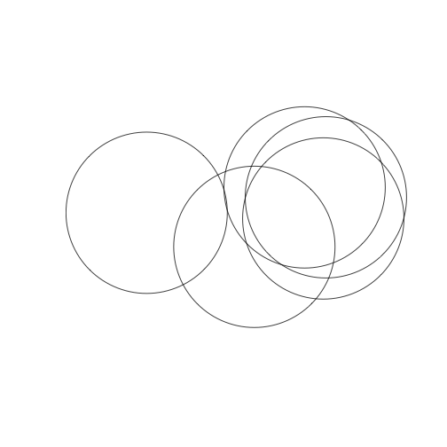

Working with vector data
========================================================
Geometry operators


```r
st_buffer(pts, 1) %>%
  st_union() %>%
  plot()
```

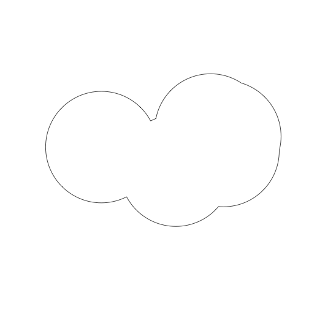

Working with vector data
========================================================
Geometry operators


```r
st_combine(pts) %>%
  st_convex_hull() %>%
  ggplot() + geom_sf() +
  geom_sf(data = pts) +
  theme_bw()
```

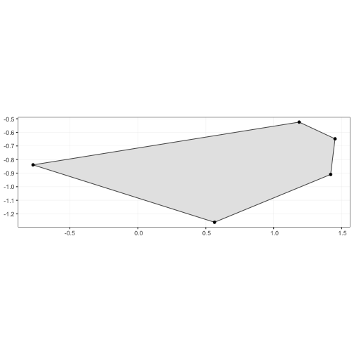

Working with vector data
========================================================
type: sub-section
- Simple features
- The `rgdal` package
- Vector data IO
- `sp` classes
- Creating vector data
- Plotting vector data
- Reprojecting data
- Geometry operators
- Geometry operators
- **Basic point processes**
- Interpolation and Kriging

Working with vector data
========================================================
Basic point processes

- Point process models focus on spatial pattern of locations
- Point patterns can be
  - unmarked -- just the locations
  - marked -- values associated with each point
- Main questions
  - What is the intensity (points / area) of the pattern?
  - Are the points related to each other in some way?
  - Is the pattern the same everywhere or different in different places?

Working with vector data
========================================================
Basic point processes

- Libraries
  - `spatial`
  - `spatstat`
  - `MarkedPointProcess`
  - `splancs`
  - many others

Working with vector data
========================================================
Basic point processes


```r
library(spatstat)
library(spatstat.data)
library(maptools)
trees = st_read("example-data/rainforest", "beilschmiedia")
```

```
Reading layer `beilschmiedia' from data source `/Users/tkeitt/Dropbox/R/keitt.ssi.2019/inst/materials/lectures/example-data/rainforest' using driver `ESRI Shapefile'
Simple feature collection with 3604 features and 1 field
geometry type:  POINT
dimension:      XY
bbox:           xmin: 0.1 ymin: 0.1 xmax: 998.9 ymax: 499.9
epsg (SRID):    NA
proj4string:    NA
```

```r
show(trees[1:3,])
```

```
Simple feature collection with 3 features and 1 field
geometry type:  POINT
dimension:      XY
bbox:           xmin: 11.7 ymin: 151.1 xmax: 998.9 ymax: 433.5
epsg (SRID):    NA
proj4string:    NA
  X1_ln__            geometry
1       1  POINT (11.7 151.1)
2       2 POINT (998.9 430.5)
3       3 POINT (980.1 433.5)
```

Working with vector data
========================================================
Basic point processes


```r
xy = st_coordinates(trees)
win = st_read("example-data/rainforest", "window")
```

```
Reading layer `window' from data source `/Users/tkeitt/Dropbox/R/keitt.ssi.2019/inst/materials/lectures/example-data/rainforest' using driver `ESRI Shapefile'
Simple feature collection with 1 feature and 1 field
geometry type:  POLYGON
dimension:      XY
bbox:           xmin: 0 ymin: 0 xmax: 1000 ymax: 500
epsg (SRID):    NA
proj4string:    NA
```

```r
w = as(as(win, "Spatial"), "owin")
show(w)
```

```
window: polygonal boundary
enclosing rectangle: [0, 1000] x [0, 500] units
```

Working with vector data
========================================================
Basic point processes


```r
bei = ppp(xy[,1], xy[,2], window = w)
plot(bei, lwd = 2)
```


Working with vector data
========================================================
Basic point processes


```r
summary(bei)
```

```
Planar point pattern:  3604 points
Average intensity 0.007208 points per square unit

Coordinates are given to 1 decimal place
i.e. rounded to the nearest multiple of 0.1 units

Window: polygonal boundary
single connected closed polygon with 4 vertices
enclosing rectangle: [0, 1000] x [0, 500] units
Window area = 5e+05 square units
Fraction of frame area: 1
```

Working with vector data
========================================================
Basic point processes


```r
intensity(bei)
```

```
[1] 0.007208
```

```r
qc = quadratcount(bei); show(qc)
```

```
           x
y           [0,200) [200,400) [400,600) [600,800) [800,1e+03]
  [400,500]     271       401       100        32         215
  [300,400)     180       217       104        34         149
  [200,300)     334         4        26        33         172
  [100,200)     172        43        26       144          83
  [0,100)       146        89       234       338          57
```

```r
show(var(as.vector(qc)) / mean(as.vector(qc)))
```

```
[1] 83.74415
```

Working with vector data
========================================================
Basic point processes


```r
plot(bei, pch = "+")
plot(qc, col = 'red', lty = 2, cex = 2, add = TRUE)
```


Working with vector data
========================================================
Basic point processes


```r
make.hist = function()
{
  h = hist(qc, plot = FALSE)
  dens = density(qc)
  x = min(h$breaks):max(h$breaks)
  pois = list(x = x, y = dpois(x, mean(qc)))
  yrange = range(c(h$density, dens$y, pois$y))
  plot(range(x), range(yrange), type = "n", ylab = "density", xlab = "count")
  lg = "lightgrey"
  hist(qc, border = lg, col = lg, freq = F, add = T)
  lines(dens, lwd = 3, col = "steelblue")
  lines(pois, lwd = 3, col = "darkgreen")
  legend("topright", c("density", "Poisson"), col = c("steelblue", "darkgreen"), lwd = 3, bty = "n")
}
```

Working with vector data
========================================================
Basic point processes


Working with vector data
========================================================
Basic point processes

Ripley's K $$\hat{K}(r) = \frac{a}{n(n-1)}\sum_i\sum_j I(d_{ij} < r) e_{ij}$$

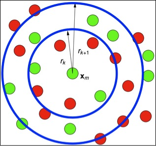

Working with vector data
========================================================
Basic point processes


```r
beiK = Kest(bei, correction = "isotropic")
invisible(plot(beiK, lwd = 3))
```

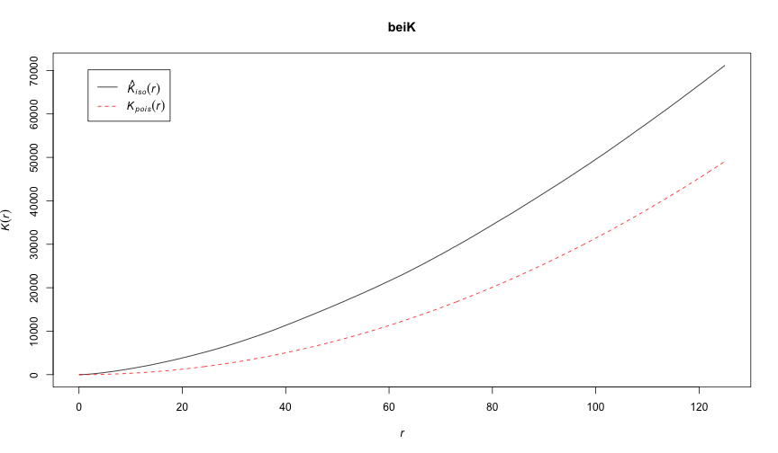

Working with vector data
========================================================
Basic point processes

Repeated Monte Carlo simulations of Poisson point process


```r
beiE = envelope(bei, nsim = 10)
```

```
Generating 10 simulations of CSR  ...
1, 2, 3, 4, 5, 6, 7, 8, 9,  10.

Done.
```

Working with vector data
========================================================
Basic point processes


```r
invisible(plot(beiE, lwd = 3))
```


Working with vector data
========================================================
Basic point processes


```r
mod1 = ppm(bei ~ x + y)  # fit poisson depending on x and y
print(mod1)
```

```
Nonstationary Poisson process

Log intensity:  ~x + y

Fitted trend coefficients:
  (Intercept)             x             y 
-4.7245290274 -0.0008031288  0.0006496090 

                 Estimate         S.E.       CI95.lo       CI95.hi Ztest
(Intercept) -4.7245290274 4.305915e-02 -4.8089234185 -4.6401346364   ***
x           -0.0008031288 5.863311e-05 -0.0009180476 -0.0006882100   ***
y            0.0006496090 1.157132e-04  0.0004228153  0.0008764027   ***
                   Zval
(Intercept) -109.721827
x            -13.697530
y              5.613957
```

Working with vector data
========================================================
Basic point processes


```r
plot(predict(mod1))
plot(bei, add = T)
```

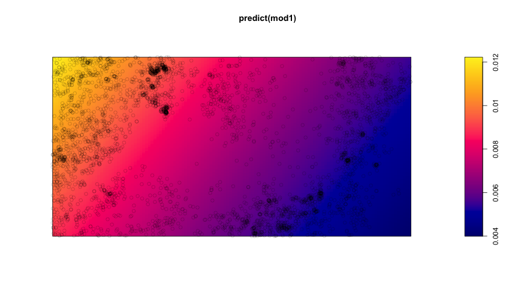

Working with vector data
========================================================
Basic point processes


```r
plot(density(bei, 100))  # kernel density estimate
plot(bei, add = T)
```

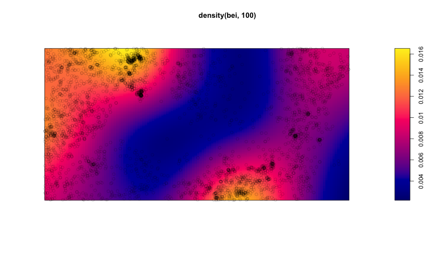

Working with vector data
========================================================
type: sub-section
- Simple features
- The `rgdal` package
- Vector data IO
- `sp` classes
- Creating vector data
- Plotting vector data
- Reprojecting data
- Geometry operators
- Geometry operators
- Basic point processes
- **Interpolation and Kriging**

Working with vector data
========================================================
Interpolation and Kriging

Thin-plate spline:

$$ y_i = f(x_i) + \epsilon_i $$

where $x_i$ are coordinates, $y_i$ are measurments and $f$ is a smooth function found by minimizing:

$$||\mathbf{y}-\mathbf{f}||^2 + \lambda \int \mathbf{f}''(x)^2 dx$$

where $\lambda$ is a smoothing parameter. The resulting $f$ smoothly interpolates the data. It is an esimate of the locally conditioned mean of $\mathbf{y}$.

Working with vector data
========================================================
Interpolation and Kriging


```r
ozone = st_read("example-data/ozone.gml", "ozone")
```

```
Reading layer `ozone' from data source `/Users/tkeitt/Dropbox/R/keitt.ssi.2019/inst/materials/lectures/example-data/ozone.gml' using driver `GML'
Simple feature collection with 41 features and 2 fields
geometry type:  POINT
dimension:      XY
bbox:           xmin: -74.7138 ymin: 40.2217 xmax: -71.0468 ymax: 43.3214
epsg (SRID):    NA
proj4string:    NA
```

```r
summary(ozone)
```


|   |      fid   |    median     |geometryProperty |
|:--|:-----------|:--------------|:----------------|
|   |ozone.1 : 1 |Min.   : 34.00 |POINT  :41       |
|   |ozone.10: 1 |1st Qu.: 58.00 |epsg:NA: 0       |
|   |ozone.11: 1 |Median : 65.00 |NA               |
|   |ozone.12: 1 |Mean   : 68.15 |NA               |
|   |ozone.13: 1 |3rd Qu.: 80.00 |NA               |
|   |ozone.14: 1 |Max.   :100.00 |NA               |
|   |(Other) :35 |NA             |NA               |

Working with vector data
========================================================
Interpolation and Kriging


```r
grna =  rgb(0.1, 0.5, 0.1, 0.25)      # transparent green
plot(st_coordinates(ozone), pch = 21, cex = ozone$median / 10, bg = grna)
points(st_coordinates(ozone), pch = 19, col = "blue"); box()
```


Working with vector data
========================================================
Interpolation and Kriging


```r
library(fields)
oz.tps = Tps(st_coordinates(ozone), ozone$median)
show(oz.tps)
```

```
Call:
Tps(x = st_coordinates(ozone), Y = ozone$median)
                                              
 Number of Observations:                41    
 Number of parameters in the null space 3     
 Parameters for fixed spatial drift     3     
 Model degrees of freedom:              8.2   
 Residual degrees of freedom:           32.8  
 GCV estimate for sigma:                13.13 
 MLE for sigma:                         12.59 
 MLE for rho:                           15970 
 lambda                                 0.0099
 User supplied rho                      NA    
 User supplied sigma^2                  NA    
Summary of estimates: 
                lambda      trA      GCV     shat -lnLike Prof converge
GCV        0.009932445 8.248602 215.7185 13.12704     155.5262        7
GCV.model           NA       NA       NA       NA           NA       NA
GCV.one    0.009932445 8.248602 215.7185 13.12704           NA        7
RMSE                NA       NA       NA       NA           NA       NA
pure error          NA       NA       NA       NA           NA       NA
REML       0.011674462 7.795437 215.7731 13.21921     155.5171        4
```

Working with vector data
========================================================
Interpolation and Kriging


```r
surface(oz.tps)
```

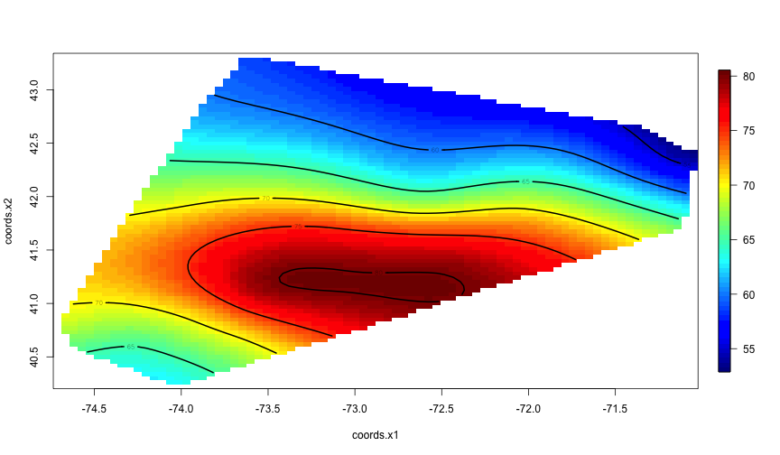

Working with vector data
========================================================
Interpolation and Kriging

Regression Kriging model

$$ Y_k = P(x_k) + Z(x_k) + \epsilon_k $$

where $P(x)$ is a low-order polynomial trend surface and $Z(x)$ is a stationary Gaussian processes with spatial covariance $\Sigma(||x_i-x_j||)$. A thin-plate spline is a special case of Kriging -- the `fields` package function `Tps` actually calls `Krig` internally.

Many more packages. See `gstat`, `geoR` and `geoRglm` among others.

Working with vector data
========================================================
Interpolation and Kriging


```r
oz.k = Krig(st_coordinates(ozone), ozone$median, theta = 20)
show(oz.k)
```

```
Call:
Krig(x = st_coordinates(ozone), Y = ozone$median, theta = 20)
                                             
 Number of Observations:                41   
 Number of parameters in the null space 3    
 Parameters for fixed spatial drift     3    
 Model degrees of freedom:              14.1 
 Residual degrees of freedom:           26.9 
 GCV estimate for sigma:                11.65
 MLE for sigma:                         11.21
 MLE for rho:                           2825 
 lambda                                 0.045
 User supplied rho                      NA   
 User supplied sigma^2                  NA   
Summary of estimates: 
               lambda      trA      GCV     shat -lnLike Prof converge
GCV        0.04179902 14.45564 206.5001 11.56257     155.1283        6
GCV.model          NA       NA       NA       NA           NA       NA
GCV.one    0.04179902 14.45564 206.5001 11.56257           NA        6
RMSE               NA       NA       NA       NA           NA       NA
pure error         NA       NA       NA       NA           NA       NA
REML       0.04452758 14.06186 206.5179 11.64852     155.1268        3
```

Working with vector data
========================================================
Interpolation and Kriging


```r
surface(oz.k)
points(st_coordinates(ozone), pch = 19)
```


Working with vector data
========================================================
Interpolation and Kriging


```r
se = predictSurfaceSE(oz.k)
plot.surface(se)
points(st_coordinates(ozone), pch = 19)
```


Working with vector data
========================================================
type: sub-section
- Simple features
- The `rgdal` package
- Vector data IO
- `sp` classes
- Creating vector data
- Plotting vector data
- Reprojecting data
- Geometry operators
- Geometry operators
- Basic point processes
- Interpolation and Kriging
