Geospatial Data Analysis in R
========================================================
author: Timothy H. Keitt
date: May 12, 2014
width: 1440
height: 900

Working with vector data
========================================================
type: section

Working with vector data
========================================================
type: sub-section
- Simple features
- The `rgdal` package
- Vector data IO
- `sp` classes
- Creating vector data
- Plotting vector data
- Reprojecting data
- The `rgeos` library
- Geometry operators
- Basic point processes
- Interpolation and Kriging

Spatial layers
========================================================
GIS building blocks


Working with vector data
========================================================
type: sub-section
- **Simple features**
- The `rgdal` package
- Vector data IO
- `sp` classes
- Creating vector data
- Plotting vector data
- Reprojecting data
- The `rgeos` library
- Geometry operators
- Basic point processes
- Interpolation and Kriging

Working with vector data
========================================================
OGC Simple Feature Hierarchy


Working with vector data
========================================================
OGC Simple Feature Hierarchy


Working with vector data
========================================================
Complex versus simple features


Most spatial operators in R require simple features

Working with vector data
========================================================
Complex versus simple features


Most spatial operators in R require simple features

Working with vector data
========================================================
OGC Simple Features Well-Known-Text


Working with vector data
========================================================
OGC Simple Features Well-Known-Text


Working with vector data
========================================================
type: sub-section
- Simple features
- **The `rgdal` package**
- Vector data IO
- `sp` classes
- Creating vector data
- Plotting vector data
- Reprojecting data
- The `rgeos` library
- Geometry operators
- Basic point processes
- Interpolation and Kriging

Working with vector data
========================================================
RGDAL package

- OGR component of GDAL handles vector data (http://www.gdal.org/)
- Data source -> data layer -> simple features
- Written in C++
- Like GDAL, large collection of runtime drivers
- Encapsulated in `rgdal` and experimental `rgdal2` packages
- With `rgdal` package, main use is to read data into `sp` classes

Working with vector data
========================================================
RGDAL package


```r
pacman::p_load(rgdal)
as.character(ogrDrivers()[[1]])
```

```
 [1] "AeronavFAA"     "AmigoCloud"     "ARCGEN"         "AVCBin"        
 [5] "AVCE00"         "BNA"            "Carto"          "Cloudant"      
 [9] "CouchDB"        "CSV"            "CSW"            "DGN"           
[13] "DXF"            "EDIGEO"         "ElasticSearch"  "ESRI Shapefile"
[17] "Geoconcept"     "GeoJSON"        "GeoRSS"         "GFT"           
[21] "GML"            "GPKG"           "GPSBabel"       "GPSTrackMaker" 
[25] "GPX"            "HTF"            "HTTP"           "Idrisi"        
[29] "JML"            "KML"            "MapInfo File"   "Memory"        
[33] "netCDF"         "ODS"            "OGR_GMT"        "OGR_PDS"       
[37] "OGR_SDTS"       "OGR_VRT"        "OpenAir"        "OpenFileGDB"   
[41] "OSM"            "PCIDSK"         "PDF"            "PGDUMP"        
[45] "PLSCENES"       "REC"            "S57"            "SEGUKOOA"      
[49] "SEGY"           "Selafin"        "SQLite"         "SUA"           
[53] "SVG"            "SXF"            "TIGER"          "UK .NTF"       
[57] "VDV"            "VFK"            "WAsP"           "WFS"           
[61] "XLSX"           "XPlane"        
```

Uniform access to many data sources

Uniform access to many data sources

Working with vector data
========================================================
type: sub-section
- Simple features
- The `rgdal` package
- **Vector data IO**
- `sp` classes
- Creating vector data
- Plotting vector data
- Reprojecting data
- The `rgeos` library
- Geometry operators
- Basic point processes
- Interpolation and Kriging

Working with vector data
========================================================
Vector data IO

- main functions
  - readOGR
  - writeOGR


```r
vecdat = readOGR("example-data/continents", "continent")
```

```
OGR data source with driver: ESRI Shapefile 
Source: "/Users/tkeitt/Dropbox/R/keitt.ssi.2019/inst/materials/lectures/example-data/continents", layer: "continent"
with 8 features
It has 1 fields
```
First argument (`dsn`) is the data source. The second argument is the layer within the data source.

Working with vector data
========================================================
Vector data IO

An ESRI shapefile is often several files stored together in a directory. The directory is the data source and the `.shp` file is the layer. Other files hold spatial reference system and tabular field data.

```r
dir("example-data")              # see the data source
```

```
[1] "continents"     "NCEAS sample"   "ozone.gml"      "ozone.xsd"     
[5] "rainforest"     "rainforest.tif"
```

```r
dir("example-data/continents")   # see the data layers
```

```
[1] "continent.dbf" "continent.prj" "continent.shp" "continent.shx"
```
Other formats are single file, in which case the data source is the file name and the layer is named within the file, typically the same as the file name without the extension.

Working with vector data
========================================================
Vector data IO

- Layers are always named and numbered within the data source
- Data sources can be directories containing files for the different layers or can be single files
- Data source can also be a relational database system or web service capable of providing simple features

```r
vecdat = readOGR("PG:dbname=mydatabase", "thetable") # not run
```
This example would load the simple features and associated attribute columns from a PostGIS (http://www.postgis.org) table stored in a PostgreSQL database (http://www.postgresql.org).

Working with vector data
========================================================
Vector data IO


```r
plot(vecdat, col = "lightblue")
```

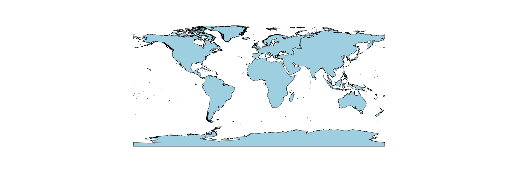

Working with vector data
========================================================
Vector data IO

`writeOGR` does the opposite

```r
dest = tempdir()
writeOGR(vecdat, dest, "newlayername", "ESRI Shapefile")
dir(dest)
unlink(dest)  # remove the output
```

Working with vector data
========================================================
type: sub-section
- Simple features
- The `rgdal` package
- Vector data IO
- **`sp` classes**
- Creating vector data
- Plotting vector data
- Reprojecting data
- The `rgeos` library
- Geometry operators
- Basic point processes
- Interpolation and Kriging

Working with vector data
========================================================
`sp` classes

```r
class(vecdat)       # sp class: help(package=sp)
```

```
[1] "SpatialPolygonsDataFrame"
attr(,"package")
[1] "sp"
```

```r
show(vecdat@data)   # data slot contains attribute table
```

```
      CONTINENT
0          Asia
1 North America
2        Europe
3        Africa
4 South America
5       Oceania
6     Australia
7    Antarctica
```

Working with vector data
========================================================
`sp` classes

Classes

Spatially-referenced geometry  | Geometries with attribute table
------------- | -------------
SpatialPoints  | SpatialPointsDataFrame
SpatialLines  | SpatialLinesDataFrame
SpatialPolygons | SpatialPolygonsDataFrame

The *xDataFrame* classes have a data frame attached. The rows of the data frame match the position in the list of geometries.

Working with vector data
========================================================
type: sub-section
- Simple features
- The `rgdal` package
- Vector data IO
- `sp` classes
- **Creating vector data**
- Plotting vector data
- Reprojecting data
- The `rgeos` library
- Geometry operators
- Basic point processes
- Interpolation and Kriging

Working with vector data
========================================================
Creating vector data


```r
loc = rbind(c(30.25, 97.75), c(42.36, 71.06),
            c(41.88, 87.63), c(37.78, 122.42))
loc = cbind(-loc[,2], loc[,1])
show(loc)
```

```
        [,1]  [,2]
[1,]  -97.75 30.25
[2,]  -71.06 42.36
[3,]  -87.63 41.88
[4,] -122.42 37.78
```

Working with vector data
========================================================
Creating vector data


```r
spts = SpatialPoints(loc, CRS("+proj=longlat +ellps=WGS84"))
nam = subset(vecdat, CONTINENT=="North America")
plot(spts, type = "n")                  # set axis limits
plot(nam, lwd = 2, xpd = NA, add = T)   # plot continent boundaries
plot(spts, cex = 4, pch = 21, bg = "orange", add = T)
```

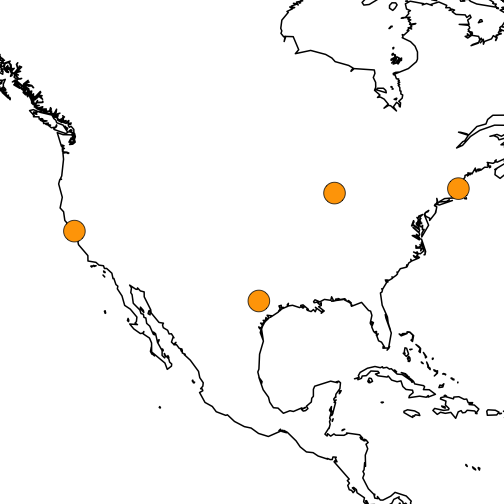

Working with vector data
========================================================
Creating vector data


```r
lut = data.frame(cities = c("Austin", "Boston",
                            "Chicago", "Los Angeles"))
spts.df = SpatialPointsDataFrame(loc, lut)
show(class(spts.df))
```

```
[1] "SpatialPointsDataFrame"
attr(,"package")
[1] "sp"
```

```r
show(spts.df)
```

```
       coordinates      cities
1  (-97.75, 30.25)      Austin
2  (-71.06, 42.36)      Boston
3  (-87.63, 41.88)     Chicago
4 (-122.42, 37.78) Los Angeles
```

Working with vector data
========================================================
Creating vector data


```r
loc = rbind(loc, loc[1,])    # 1st and last point same
lring = Polygon(loc, hole = FALSE)
poly = Polygons(list(lring), "1")  # Single ring polygon
spoly = SpatialPolygons(list(poly), proj4 = CRS("+proj=longlat +ellps=WGS84"))
show(spoly)
```

```
An object of class "SpatialPolygons"
Slot "polygons":
[[1]]
An object of class "Polygons"
Slot "Polygons":
[[1]]
An object of class "Polygon"
Slot "labpt":
[1] -96.76296  37.15718

Slot "area":
[1] 275.4836

Slot "hole":
[1] FALSE

Slot "ringDir":
[1] 1

Slot "coords":
        [,1]  [,2]
[1,]  -97.75 30.25
[2,] -122.42 37.78
[3,]  -87.63 41.88
[4,]  -71.06 42.36
[5,]  -97.75 30.25


Slot "plotOrder":
[1] 1

Slot "labpt":
[1] -96.76296  37.15718

Slot "ID":
[1] "1"

Slot "area":
[1] 275.4836


Slot "plotOrder":
[1] 1

Slot "bbox":
      min    max
x -122.42 -71.06
y   30.25  42.36

Slot "proj4string":
CRS arguments: +proj=longlat +ellps=WGS84 
```

Working with vector data
========================================================
Creating vector data


```r
plot(spts, type = "n")         # set axis limits
plot(nam, lwd = 2, col = "navajowhite", xpd = NA, add = T)
plot(spoly, col = "lightblue", add = T)
plot(spts, cex = 4, pch = 21, bg = "darkgreen", add = T)
```


Working with vector data
========================================================
type: sub-section
- Simple features
- The `rgdal` package
- Vector data IO
- `sp` classes
- Creating vector data
- **Plotting vector data**
- Reprojecting data
- The `rgeos` library
- Geometry operators
- Basic point processes
- Interpolation and Kriging

Working with vector data
========================================================
Plotting vector data

- Several different systems
- Base graphics
  - `plot`, `points`, `lines`, `polygons`
- Grid graphics
  - Low-level
  - Base for lattice and ggplot2
- Lattice
  - `xyplot`, `spplot`
- Ggplot2
  - `qplot`, `ggplot`
  - Lots of folks moving to this

Working with vector data
========================================================
Plotting vector data

The `plot` command is specialized for `sp` classes and will generally do the right thing. A few switches:

- `type` -- one of `p, l, o, n` (points, lines, points-lines, suppress output)
- `add` -- if `TRUE` then overlay on current plot
- `cex` -- symbol magnification factor
- `lwd` -- line width
- `col` -- the color to use (many ways to specify; see `rgb`)
- `bg` -- the background or fill color
- `xpd` -- if set to `NA` will supress clipping at plot borders
- `pch` -- symbol for points (21 = filled circle)

Working with vector data
========================================================
type: sub-section
- Simple features
- The `rgdal` package
- Vector data IO
- `sp` classes
- Creating vector data
- Plotting vector data
- **Reprojecting data**
- The `rgeos` library
- Geometry operators
- Basic point processes
- Interpolation and Kriging

Working with vector data
========================================================
Reprojecting data


Working with vector data
========================================================
Reprojecting data


```r
p4s = "+proj=laea +lat_0=45 +lon_0=-100 +x_0=0 +y_0=0 +a=6370997 +b=6370997 +units=m +no_defs" # US National Atlas
nam.laea = spTransform(nam, CRS(p4s))
spoly.laea = spTransform(spoly, CRS(p4s))
spts.laea = spTransform(spts, CRS(p4s))
show(spts.laea)
```

```
SpatialPoints:
      coords.x1  coords.x2
[1,]   217894.6 -1632769.3
[2,]  2316750.9   124310.3
[3,]  1019668.8  -269814.5
[4,] -1945033.1  -538365.0
Coordinate Reference System (CRS) arguments: +proj=laea +lat_0=45
+lon_0=-100 +x_0=0 +y_0=0 +a=6370997 +b=6370997 +units=m +no_defs 
```

Working with vector data
========================================================
Reprojecting data


```r
plot(spts, type = "n")         # set axis limits
plot(nam, lwd = 2, col = "navajowhite", xpd = NA, add = T)
plot(spoly, col = "lightblue", add = T)
plot(spts, cex = 4, pch = 21, bg = "darkgreen", add = T)
```

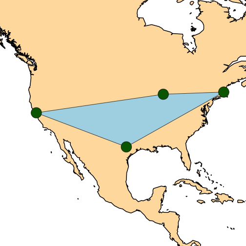

Working with vector data
========================================================
Reprojecting data


```r
plot(spts.laea, type = "n")         # set axis limits
plot(nam.laea, lwd = 2, col = "navajowhite", xpd = NA, add = T)
plot(spoly.laea, col = "lightblue", add = T)
plot(spts.laea, cex = 4, pch = 21, bg = "darkgreen", add = T)
```

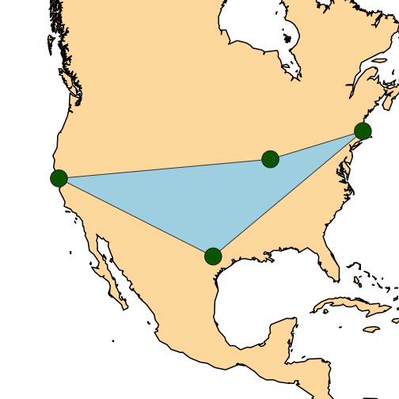

Working with vector data
========================================================
Reprojecting data

- Based on PROJ4 software, see http://trac.osgeo.org/proj/
- Look up `proj4string` at: http://spatialreference.org/
- Large libraries of "canned" definitions
  - European Petroleum Survey Group (EPSG)
  - ESRI
  - International Astronomical Union (IAU)
- These define parameters, units, earth model, etc.

Working with vector data
========================================================
type: sub-section
- Simple features
- The `rgdal` package
- Vector data IO
- `sp` classes
- Creating vector data
- Plotting vector data
- Reprojecting data
- **The `rgeos` library**
- Geometry operators
- Basic point processes
- Interpolation and Kriging

Working with vector data
========================================================
The `rgeos` library

- Wrapper for the Geometry Engine - Open Source
- C++ port of Java Topology Suite
- Used by PostGIS for geometry operations
- Also exposed by GDAL, but not wrapped in `rgdal` (is in `rgdal2`)

Working with vector data
========================================================
The `rgeos` library

Uses simple features

  - POINT
  - LINESTRING
  - POLYGON
  - MULTIPOINT
  - MULTILINESTRING
  - MULTIPOLYGON
  - GEOMETRYCOLLECTION

stored in `sp` classes

Working with vector data
========================================================
The `rgeos` library

Read in `sp` objecst using `rgdal` or other software or construct from WKT


```r
pacman::p_load(rgeos)
p1 = readWKT("POINT(-97.75 30.25)", p4s = "+proj=longlat +ellps=WGS84")
show(p1)
```

```
SpatialPoints:
       x     y
1 -97.75 30.25
Coordinate Reference System (CRS) arguments: +proj=longlat
+ellps=WGS84 
```

```r
writeWKT(p1)
```

```
[1] "POINT (-97.7500000000000000 30.2500000000000000)"
```

Working with vector data
========================================================
The `rgeos` library


```r
p2 = readWKT("POINT(-71.06 42.36)", p4s = "+proj=longlat +ellps=WGS84")
gDistance(p1, p2)    # Euclidian distance!
```

```
[1] 29.30884
```

```r
pacman::p_load(geosphere)
distm(p1, p2)  # in meters
```


|        |
|-------:|
| 2731121|

```r
gc = SpatialPoints(greatCircle(p1, p2), proj = CRS("+proj=longlat +ellps=WGS84"))
```

Working with vector data
========================================================
The `rgeos` library


```r
plot(spts, type = "n")         # set axis limits
plot(nam, lwd = 2, col = "navajowhite", xpd = NA, add = T)
plot(gc, lwd = 3, col = "lightblue", add = T)
plot(spts, cex = 4, pch = 21, bg = "darkgreen", add = T)
```

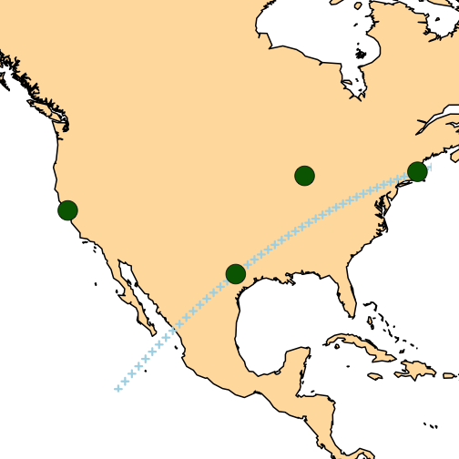

Working with vector data
========================================================
type: sub-section
- Simple features
- The `rgdal` package
- Vector data IO
- `sp` classes
- Creating vector data
- Plotting vector data
- Reprojecting data
- The `rgeos` library
- **Geometry operators**
- Basic point processes
- Interpolation and Kriging

Working with vector data
========================================================
Geometry operators

Spatial sets


Working with vector data
========================================================


Working with vector data
========================================================
Geometry operators

Spatial sets


Working with vector data
========================================================
Geometry operators


```r
sp1 = readWKT("POLYGON ((10 10, 15 0, 25 0, 30 10, 25 20, 15 20, 10 10))")
sp2 = readWKT("POLYGON ((20 10, 30 0, 40 10, 30 20, 20 10))")
plot(gUnion(sp1, sp2), type = "n")
plot(sp1, col = "lightblue", add = T)
plot(sp2, col = "lightgreen", add = T)
plot(gIntersection(sp1, sp2), col = "lightyellow", add = T)
```

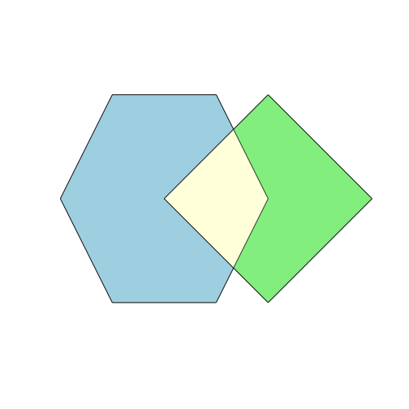

Working with vector data
========================================================
Geometry operators


```r
rel = gRelate(sp1, sp2); show(rel)
```

```
[1] "212101212"
```

```r
mat = matrix(unlist(strsplit(rel, "")), 3)
typ = c("interior", "boundary", "exterior")
dimnames(mat) = list(typ, typ)
mode(mat) = "numeric"; show(mat)
```

```
         interior boundary exterior
interior        2        1        2
boundary        1        0        1
exterior        2        1        2
```

Working with vector data
========================================================
Geometry operators

<p>Consider the following definition of Area/Area overlap:</p>
<table border="1" class="docutils">
<colgroup>
<col width="17%" />
<col width="28%" />
<col width="28%" />
<col width="28%" />
</colgroup>
<tbody valign="top">
<tr class="row-odd"><td>OVERLAP</td>
<td>Interior</td>
<td>Boundary</td>
<td>Exterior</td>
</tr>
<tr class="row-even"><td>Interior</td>
<td>T</td>
<td>*</td>
<td>T</td>
</tr>
<tr class="row-odd"><td>Boundary</td>
<td>*</td>
<td>*</td>
<td>*</td>
</tr>
<tr class="row-even"><td>Exterior</td>
<td>T</td>
<td>*</td>
<td>*</td>
</tr>
</tbody>
</table>
<p>

As a string: T\*T\*\*\*T\*\*

http://docs.geotools.org/stable/userguide/library/jts/dim9.html

Working with vector data
========================================================
Geometry operators

<table border="1" class="docutils">
<colgroup>
<col width="22%" />
<col width="25%" />
<col width="16%" />
<col width="37%" />
</colgroup>
<thead valign="bottom">
<tr class="row-odd"><th class="head">Relationship</th>
<th class="head">Area/Area Pattern</th>
<th class="head">&#8220;212101212&#8221;</th>
<th class="head">Description</th>
</tr>
</thead>
<tbody valign="top">
<tr class="row-even"><td>Disjoint</td>
<td>FF*FF****</td>
<td>false</td>
<td>x is not disjoint from y</td>
</tr>
<tr class="row-odd"><td>Touches</td>
<td>FT*******</td>
<td>false</td>
<td>x does not just touch y</td>
</tr>
<tr class="row-even"><td>Touches</td>
<td>F***T****</td>
<td>false</td>
<td>x does not just touch y</td>
</tr>
<tr class="row-odd"><td>Crosses</td>
<td>T*T***T**</td>
<td>true</td>
<td>x crosses y</td>
</tr>
<tr class="row-even"><td>Within</td>
<td>TF*F*****</td>
<td>false</td>
<td>x is not within y</td>
</tr>
<tr class="row-odd"><td>Overlaps</td>
<td>T*T***T**</td>
<td>true</td>
<td>x overlaps y</td>
</tr>
</tbody>
</table>


Working with vector data
========================================================
Geometry operators


```r
pts = SpatialPoints(matrix(rnorm(10), 5))
plot(pts, cex = 4, pch = 21, bg = "lightblue")
```

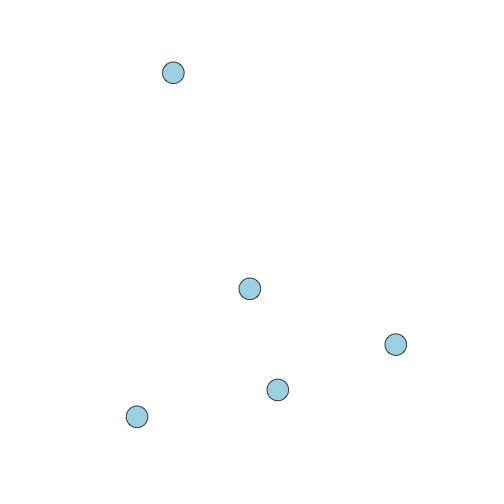

Working with vector data
========================================================
Geometry operators


```r
plot(gBuffer(pts), lwd = 3)
plot(pts, cex = 4, pch = 21, bg = "lightblue", add = T)
```

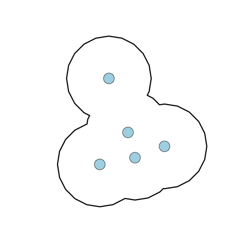

Working with vector data
========================================================
Geometry operators


```r
plot(gBuffer(gConvexHull(pts)), lwd = 3)
plot(gConvexHull(pts), lwd = 3, add = T)
plot(pts, cex = 4, pch = 21, bg = "lightblue", add = T)
```

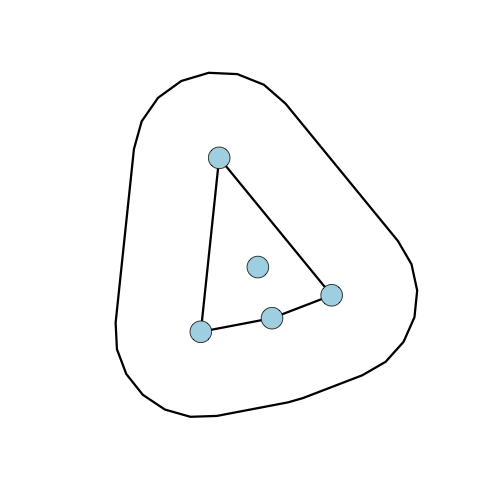

Working with vector data
========================================================
type: sub-section
- Simple features
- The `rgdal` package
- Vector data IO
- `sp` classes
- Creating vector data
- Plotting vector data
- Reprojecting data
- The `rgeos` library
- Geometry operators
- **Basic point processes**
- Interpolation and Kriging

Working with vector data
========================================================
Basic point processes

- Point process models focus on spatial pattern of locations
- Point patterns can be
  - unmarked -- just the locations
  - marked -- values associated with each point
- Main questions
  - What is the intensity (points / area) of the pattern?
  - Are the points related to each other in some way?
  - Is the pattern the same everywhere or different in different places?

Working with vector data
========================================================
Basic point processes

- Libraries
  - `spatial`
  - `spatstat`
  - `MarkedPointProcess`
  - `splancs`
  - many others

Working with vector data
========================================================
Basic point processes


```r
pacman::p_load(spatstat)
pacman::p_load(maptools)
pacman::p_load(rgdal)
trees = readOGR("example-data/rainforest", "beilschmiedia")
```

```
OGR data source with driver: ESRI Shapefile 
Source: "/Users/tkeitt/Dropbox/R/keitt.ssi.2019/inst/materials/lectures/example-data/rainforest", layer: "beilschmiedia"
with 3604 features
It has 1 fields
Integer64 fields read as strings:  X1_ln__ 
```

```r
show(trees[1:3,])
```

```
     coordinates X1_ln__
1  (11.7, 151.1)       1
2 (998.9, 430.5)       2
3 (980.1, 433.5)       3
```

Working with vector data
========================================================
Basic point processes


```r
xy = coordinates(trees)
win = readOGR("example-data/rainforest", "window")
```

```
OGR data source with driver: ESRI Shapefile 
Source: "/Users/tkeitt/Dropbox/R/keitt.ssi.2019/inst/materials/lectures/example-data/rainforest", layer: "window"
with 1 features
It has 1 fields
Integer64 fields read as strings:  X1_ln__ 
```

```r
w = as(win, "owin")
show(w)
```

```
window: polygonal boundary
enclosing rectangle: [0, 1000] x [0, 500] units
```

Working with vector data
========================================================
Basic point processes


```r
bei = ppp(xy[,1], xy[,2], window = w)
plot(bei, lwd = 2)
```


Working with vector data
========================================================
Basic point processes


```r
summary(bei)
```

```
Planar point pattern:  3604 points
Average intensity 0.007208 points per square unit

Coordinates are given to 1 decimal place
i.e. rounded to the nearest multiple of 0.1 units

Window: polygonal boundary
single connected closed polygon with 4 vertices
enclosing rectangle: [0, 1000] x [0, 500] units
Window area = 5e+05 square units
Fraction of frame area: 1
```

Working with vector data
========================================================
Basic point processes


```r
intensity(bei)
```

```
[1] 0.007208
```

```r
qc = quadratcount(bei); show(qc)
```

```
           x
y           [0,200) [200,400) [400,600) [600,800) [800,1e+03]
  [400,500]     271       401       100        32         215
  [300,400)     180       217       104        34         149
  [200,300)     334         4        26        33         172
  [100,200)     172        43        26       144          83
  [0,100)       146        89       234       338          57
```

```r
show(var(as.vector(qc)) / mean(as.vector(qc)))
```

```
[1] 83.74415
```

Working with vector data
========================================================
Basic point processes


```r
plot(bei, pch = "+")
plot(qc, col = 'red', lty = 2, cex = 2, add = TRUE)
```

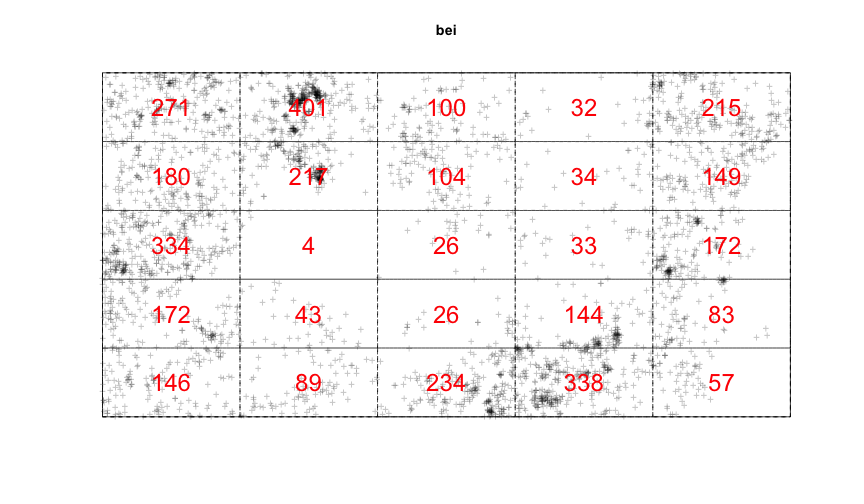

Working with vector data
========================================================
Basic point processes


```r
make.hist = function()
{
  h = hist(qc, plot = FALSE)
  dens = density(qc)
  x = min(h$breaks):max(h$breaks)
  pois = list(x = x, y = dpois(x, mean(qc)))
  yrange = range(c(h$density, dens$y, pois$y))
  plot(range(x), range(yrange), type = "n", ylab = "density", xlab = "count")
  lg = "lightgrey"
  hist(qc, border = lg, col = lg, freq = F, add = T)
  lines(dens, lwd = 3, col = "steelblue")
  lines(pois, lwd = 3, col = "darkgreen")
  legend("topright", c("density", "Poisson"), col = c("steelblue", "darkgreen"), lwd = 3, bty = "n")
}
```

Working with vector data
========================================================
Basic point processes

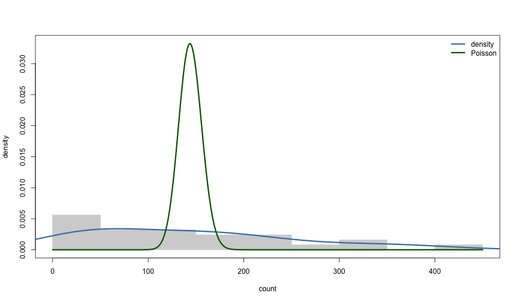

Working with vector data
========================================================
Basic point processes

Ripley's K $$\hat{K}(r) = \frac{a}{n(n-1)}\sum_i\sum_j I(d_{ij} < r) e_{ij}$$


Working with vector data
========================================================
Basic point processes


```r
beiK = Kest(bei, correction = "isotropic")
invisible(plot(beiK))
```


Working with vector data
========================================================
Basic point processes

Repeated Monte Carlo simulations of Poisson point process


```r
beiE = envelope(bei, nsim = 10)
```

```
Generating 10 simulations of CSR  ...
1, 2, 3, 4, 5, 6, 7, 8, 9,  10.

Done.
```

Working with vector data
========================================================
Basic point processes


```r
invisible(plot(beiE))
```

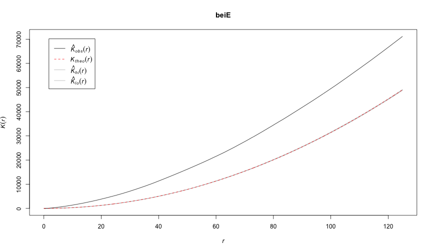

Working with vector data
========================================================
Basic point processes


```r
mod1 = ppm(bei ~ x + y)  # fit poisson depending on x and y
print(mod1)
```

```
Nonstationary Poisson process

Log intensity:  ~x + y

Fitted trend coefficients:
  (Intercept)             x             y 
-4.7245290274 -0.0008031288  0.0006496090 

                 Estimate         S.E.       CI95.lo       CI95.hi Ztest
(Intercept) -4.7245290274 4.305915e-02 -4.8089234185 -4.6401346364   ***
x           -0.0008031288 5.863311e-05 -0.0009180476 -0.0006882100   ***
y            0.0006496090 1.157132e-04  0.0004228153  0.0008764027   ***
                   Zval
(Intercept) -109.721827
x            -13.697530
y              5.613957
```

Working with vector data
========================================================
Basic point processes


```r
plot(predict(mod1))
plot(bei, add = T)
```


Working with vector data
========================================================
Basic point processes


```r
plot(density(bei, 100))  # kernel density estimate
plot(bei, add = T)
```


Working with vector data
========================================================
type: sub-section
- Simple features
- The `rgdal` package
- Vector data IO
- `sp` classes
- Creating vector data
- Plotting vector data
- Reprojecting data
- The `rgeos` library
- Geometry operators
- Basic point processes
- **Interpolation and Kriging**

Working with vector data
========================================================
Interpolation and Kriging

Thin-plate spline:

$$ y_i = f(x_i) + \epsilon_i $$

where $x_i$ are coordinates, $y_i$ are measurments and $f$ is a smooth function found by minimizing:

$$||\mathbf{y}-\mathbf{f}||^2 + \lambda \int \mathbf{f}''(x)^2 dx$$

where $\lambda$ is a smoothing parameter. The resulting $f$ smoothly interpolates the data. It is an esimate of the locally conditioned mean of $\mathbf{y}$.

Working with vector data
========================================================
Interpolation and Kriging


```r
ozone = readOGR("example-data/ozone.gml", "ozone")
```

```
OGR data source with driver: GML 
Source: "/Users/tkeitt/Dropbox/R/keitt.ssi.2019/inst/materials/lectures/example-data/ozone.gml", layer: "ozone"
with 41 features
It has 2 fields
```

```r
summary(ozone)
```

```
Object of class SpatialPointsDataFrame
Coordinates:
               min      max
coords.x1 -74.7138 -71.0468
coords.x2  40.2217  43.3214
Is projected: NA 
proj4string : [NA]
Number of points: 41
Data attributes:
       fid         median      
 ozone.1 : 1   Min.   : 34.00  
 ozone.10: 1   1st Qu.: 58.00  
 ozone.11: 1   Median : 65.00  
 ozone.12: 1   Mean   : 68.15  
 ozone.13: 1   3rd Qu.: 80.00  
 ozone.14: 1   Max.   :100.00  
 (Other) :35                   
```

Working with vector data
========================================================
Interpolation and Kriging


```r
grna =  rgb(0.1, 0.5, 0.1, 0.25)      # transparent green
plot(ozone, pch = 21, cex = ozone$median / 10, bg = grna)
points(ozone, pch = 19, col = "blue"); box()
```


Working with vector data
========================================================
Interpolation and Kriging


```r
pacman::p_load(fields)
oz.tps = Tps(coordinates(ozone), ozone$median)
show(oz.tps)
```

```
Call:
Tps(x = coordinates(ozone), Y = ozone$median)
                                              
 Number of Observations:                41    
 Number of parameters in the null space 3     
 Parameters for fixed spatial drift     3     
 Model degrees of freedom:              8.2   
 Residual degrees of freedom:           32.8  
 GCV estimate for sigma:                13.13 
 MLE for sigma:                         12.59 
 MLE for rho:                           15970 
 lambda                                 0.0099
 User supplied rho                      NA    
 User supplied sigma^2                  NA    
Summary of estimates: 
                lambda      trA      GCV     shat -lnLike Prof converge
GCV        0.009932445 8.248602 215.7185 13.12704     155.5262        7
GCV.model           NA       NA       NA       NA           NA       NA
GCV.one    0.009932445 8.248602 215.7185 13.12704           NA        7
RMSE                NA       NA       NA       NA           NA       NA
pure error          NA       NA       NA       NA           NA       NA
REML       0.011674462 7.795437 215.7731 13.21921     155.5171        4
```

Working with vector data
========================================================
Interpolation and Kriging


```r
surface(oz.tps)
```


Working with vector data
========================================================
Interpolation and Kriging

Regression Kriging model

$$ Y_k = P(x_k) + Z(x_k) + \epsilon_k $$

where $P(x)$ is a low-order polynomial trend surface and $Z(x)$ is a stationary Gaussian processes with spatial covariance $\Sigma(||x_i-x_j||)$. A thin-plate spline is a special case of Kriging -- the `fields` package function `Tps` actually calls `Krig` internally.

Many more packages. See `gstat`, `geoR` and `geoRglm` among others.

Working with vector data
========================================================
Interpolation and Kriging


```r
oz.k = Krig(coordinates(ozone), ozone$median, theta = 20)
show(oz.k)
```

```
Call:
Krig(x = coordinates(ozone), Y = ozone$median, theta = 20)
                                             
 Number of Observations:                41   
 Number of parameters in the null space 3    
 Parameters for fixed spatial drift     3    
 Model degrees of freedom:              14.1 
 Residual degrees of freedom:           26.9 
 GCV estimate for sigma:                11.65
 MLE for sigma:                         11.21
 MLE for rho:                           2825 
 lambda                                 0.045
 User supplied rho                      NA   
 User supplied sigma^2                  NA   
Summary of estimates: 
               lambda      trA      GCV     shat -lnLike Prof converge
GCV        0.04179902 14.45564 206.5001 11.56257     155.1283        6
GCV.model          NA       NA       NA       NA           NA       NA
GCV.one    0.04179902 14.45564 206.5001 11.56257           NA        6
RMSE               NA       NA       NA       NA           NA       NA
pure error         NA       NA       NA       NA           NA       NA
REML       0.04452758 14.06186 206.5179 11.64852     155.1268        3
```

Working with vector data
========================================================
Interpolation and Kriging


```r
surface(oz.k)
points(coordinates(ozone), pch = 19)
```


Working with vector data
========================================================
Interpolation and Kriging


```r
se = predictSurfaceSE(oz.k)
plot.surface(se)
points(coordinates(ozone), pch = 19)
```


Working with vector data
========================================================
type: sub-section
- Simple features
- The `rgdal` package
- Vector data IO
- `sp` classes
- Creating vector data
- Plotting vector data
- Reprojecting data
- The `rgeos` library
- Geometry operators
- Basic point processes
- Interpolation and Kriging
