Geospatial Data Analysis in R
========================================================
author: Timothy H. Keitt
date: May 23, 2018
width: 1440
height: 900

Working with raster data
========================================================
type: section

Working with raster data
========================================================
type: sub-section
- Raster data
- `sp` raster classes
- the `raster` package
- correlogram example

Working with raster data
========================================================
type: sub-section
- **Raster data**
- `sp` raster classes
- the `raster` package
- correlogram example

Working with raster data
========================================================
Raster data


Location is implicit using row and column offsets

Working with raster data
========================================================
Raster data

- Models spatial field of measurements
- May have a mask to indicate region of interest
- Cells can represent
  - Point measurements, usually at cell center
  - Areal data integrated over the cell surface
- Unfortunately not always made explicit

***


Working with raster data
========================================================
type: sub-section
- Raster data
- **`sp` raster classes**
- the `raster` package
- correlogram example

Working with raster data
========================================================
`sp` raster classes

Two types
- `SpatialPixels` -- `SpatialPixelsDataFrame`
  - Models an incomplete array of raster locations
- `SpatialGrid` -- `SpatialGridDataFrame`
  - Models a fully gridded raster dataset

Working with raster data
========================================================
`sp` raster classes


```r
library(sp)
x = matrix(TRUE, 10, 10)
x[lower.tri(x)] = FALSE
show(x)
```

```
       [,1]  [,2]  [,3]  [,4]  [,5]  [,6]  [,7]  [,8]  [,9] [,10]
 [1,]  TRUE  TRUE  TRUE  TRUE  TRUE  TRUE  TRUE  TRUE  TRUE  TRUE
 [2,] FALSE  TRUE  TRUE  TRUE  TRUE  TRUE  TRUE  TRUE  TRUE  TRUE
 [3,] FALSE FALSE  TRUE  TRUE  TRUE  TRUE  TRUE  TRUE  TRUE  TRUE
 [4,] FALSE FALSE FALSE  TRUE  TRUE  TRUE  TRUE  TRUE  TRUE  TRUE
 [5,] FALSE FALSE FALSE FALSE  TRUE  TRUE  TRUE  TRUE  TRUE  TRUE
 [6,] FALSE FALSE FALSE FALSE FALSE  TRUE  TRUE  TRUE  TRUE  TRUE
 [7,] FALSE FALSE FALSE FALSE FALSE FALSE  TRUE  TRUE  TRUE  TRUE
 [8,] FALSE FALSE FALSE FALSE FALSE FALSE FALSE  TRUE  TRUE  TRUE
 [9,] FALSE FALSE FALSE FALSE FALSE FALSE FALSE FALSE  TRUE  TRUE
[10,] FALSE FALSE FALSE FALSE FALSE FALSE FALSE FALSE FALSE  TRUE
```

Working with raster data
========================================================
`sp` raster classes


```r
pts = which(x, arr.ind = TRUE)
head(pts)  # note that these are y, x coordinates
```

```
     row col
[1,]   1   1
[2,]   1   2
[3,]   2   2
[4,]   1   3
[5,]   2   3
[6,]   3   3
```

```r
names(pts) = c("x", "y")  # change them for convenience
```

Working with raster data
========================================================
`sp` raster classes


```r
spts = SpatialPoints(pts)
spix = SpatialPixels(spts)
head(spix)
```

```
Object of class SpatialPixels
Grid topology:
    cellcentre.offset cellsize cells.dim
row                 1        1        10
col                 1        1        10
SpatialPoints:
     row col
[1,]   1   1
[2,]   1   2
[3,]   2   2
[4,]   1   3
[5,]   2   3
[6,]   3   3
Coordinate Reference System (CRS) arguments: NA 
```

Working with raster data
========================================================
`sp` raster classes


```r
plot(spix, pch = 21, bg = "steelblue", cex = 2)
box()
```

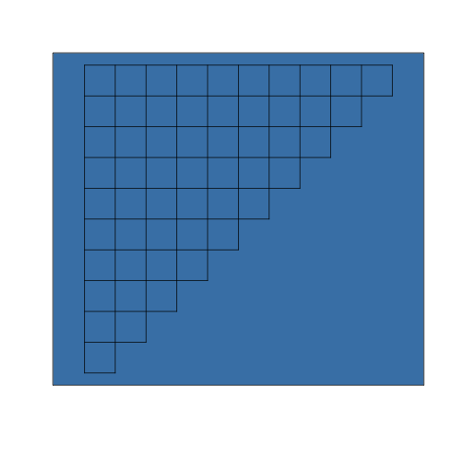

Working with raster data
========================================================
`sp` raster classes


```r
library(lattice)
spixdf = SpatialPointsDataFrame(spix, data.frame(id = 1:nrow(pts)))
trellis.par.set(regions = list(col = topo.colors(100)))
spplot(spixdf, cex = 3)   # colored by id
```

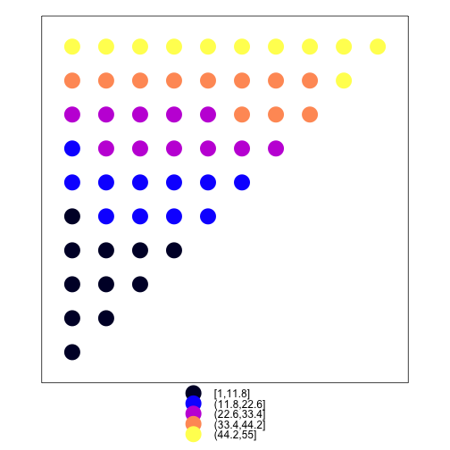

Working with raster data
========================================================
`sp` raster classes


```r
spixdf$rand = rpois(nrow(spixdf), 3)        # Add a column
trellis.par.set(regions = list(col = topo.colors(100)))
spplot(spixdf, "rand", cex = spixdf$rand)   # colored by rand
```

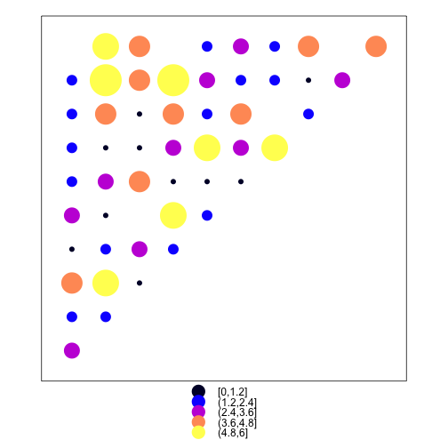

Working with raster data
========================================================
`sp` raster classes


```r
data(meuse.grid)  # ordinary data frame
head(meuse.grid)
```

```
       x      y part.a part.b      dist soil ffreq
1 181180 333740      1      0 0.0000000    1     1
2 181140 333700      1      0 0.0000000    1     1
3 181180 333700      1      0 0.0122243    1     1
4 181220 333700      1      0 0.0434678    1     1
5 181100 333660      1      0 0.0000000    1     1
6 181140 333660      1      0 0.0122243    1     1
```

```r
coordinates(meuse.grid) = ~ x + y  # x, y are column names
class(meuse.grid)
```

```
[1] "SpatialPointsDataFrame"
attr(,"package")
[1] "sp"
```

Working with raster data
========================================================
`sp` raster classes


```r
gridded(meuse.grid)           # is there a grid topology attribute?
```

```
[1] FALSE
```

```r
gridded(meuse.grid) = TRUE    # add the grid topology attribute
meuse.grid@grid               # describes the grid layout
```

```
                       x      y
cellcentre.offset 178460 329620
cellsize              40     40
cells.dim             78    104
```

Working with raster data
========================================================
`sp` raster classes


```r
spplot(meuse.grid, par.strip.text = list(cex = 3))
```

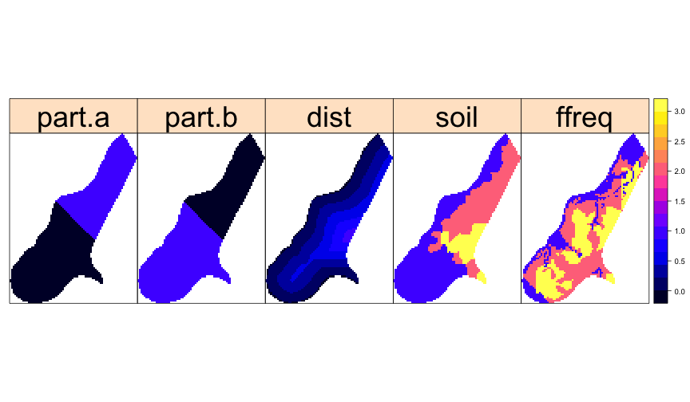

Working with raster data
========================================================
`sp` raster classes

`SpatialGrid` -- `SpatialGridDataFrame` work a bit differently. First we define the grid, then combine it with the data.


```r
g = GridTopology(c(0.5, 0.5), c(1, 1), c(100, 100))
class(g)
```

```
[1] "GridTopology"
attr(,"package")
[1] "sp"
```

```r
summary(g)
```

```
Grid topology:
  cellcentre.offset cellsize cells.dim
1               0.5        1       100
2               0.5        1       100
```

Working with raster data
========================================================
`sp` raster classes


```r
sg = SpatialGrid(g)
summary(sg)
```

```
Object of class SpatialGrid
Coordinates:
     min max
[1,]   0 100
[2,]   0 100
Is projected: NA 
proj4string : [NA]
Grid attributes:
  cellcentre.offset cellsize cells.dim
1               0.5        1       100
2               0.5        1       100
```

Working with raster data
========================================================
`sp` raster classes


```r
library(fields)
xy = list(x = 0:99 + 0.5, y = 0:99 + 0.5)
surf = sim.rf(Exp.image.cov(grid = xy, theta = 20, setup = TRUE))
image(surf, col = topo.colors(100))
```

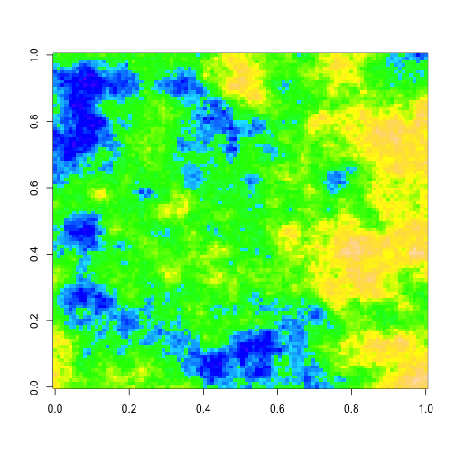

Working with raster data
========================================================
`sp` raster classes


```r
sgdf = SpatialGridDataFrame(sg, data.frame(as.vector(surf)))
summary(sgdf)
```

```
Object of class SpatialGridDataFrame
Coordinates:
     min max
[1,]   0 100
[2,]   0 100
Is projected: NA 
proj4string : [NA]
Grid attributes:
  cellcentre.offset cellsize cells.dim
1               0.5        1       100
2               0.5        1       100
Data attributes:
 as.vector.surf.  
 Min.   :-2.7178  
 1st Qu.:-0.7324  
 Median :-0.1878  
 Mean   :-0.1891  
 3rd Qu.: 0.3430  
 Max.   : 2.8305  
```

Working with raster data
========================================================
`sp` raster classes


```r
image(sgdf, col = topo.colors(100))
```

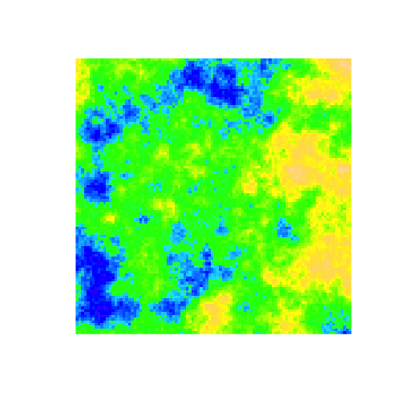

Working with raster data
========================================================
type: sub-section
- Raster data
- `sp` raster classes
- **the `raster` package**
- correlogram example

Working with raster data
========================================================
the `raster` package

- Extensive GIS capabilities for raster gridded datasets
- Work with in-memory and on-disk data
- Bind together multiple files into a single object
- Raster algebra -- evaluate expression of raster layers
- Reprojection, resampling, recoding
- Spatial intersections and unions
- Clustering, rasterization, model prediction
- Plotting, format conversions

Working with raster data
========================================================
the `raster` package


```r
library(raster)
x = raster(nrows = 4, ncols = 4, xmn = 0, xmx = 4, ymn = 0, ymx = 4)
show(x)   # empty raster
```

```
class      : RasterLayer 
dimensions : 4, 4, 16  (nrow, ncol, ncell)
resolution : 1, 1  (x, y)
extent     : 0, 4, 0, 4  (xmin, xmax, ymin, ymax)
crs        : +proj=longlat +datum=WGS84 +ellps=WGS84 +towgs84=0,0,0 
```

Working with raster data
========================================================
the `raster` package


```r
x[]     # retrieve stored values
```

```
 [1] NA NA NA NA NA NA NA NA NA NA NA NA NA NA NA NA
```

```r
x[] = rpois(16, 3)
x[]
```

```
 [1] 1 2 2 2 4 2 3 3 1 2 2 1 3 2 6 6
```

Working with raster data
========================================================
the `raster` package


```r
plot(x)
```


Working with raster data
========================================================
the `raster` package


```r
values(x)
```

```
 [1] 1 2 2 2 4 2 3 3 1 2 2 1 3 2 6 6
```

```r
x = x + 1
values(x)
```

```
 [1] 2 3 3 3 5 3 4 4 2 3 3 2 4 3 7 7
```

Working with raster data
========================================================
the `raster` package


```r
y = aggregate(x, 2, "mean")
values(y)
```

```
[1] 3.25 3.50 3.00 4.75
```

```r
plot(y)
```

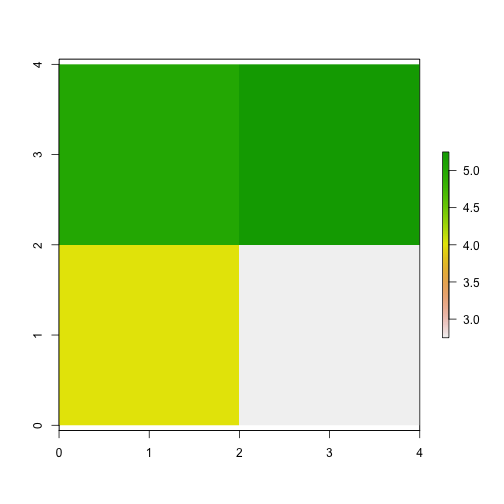

Working with raster data
========================================================
the `raster` package


```r
filename = system.file("external/test.grd", package="raster")
r = raster(filename)
plot(r, main='RasterLayer from file')
```

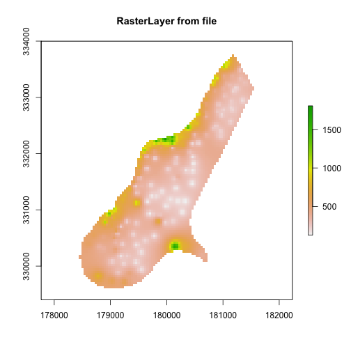

Working with raster data
========================================================
the `raster` package


```r
b <- brick(system.file("external/rlogo.grd", package="raster"))
plot(b)
```

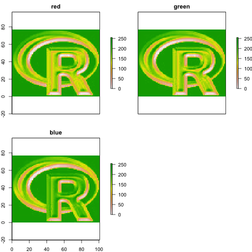

Working with raster data
========================================================
the `raster` package


```r
plotRGB(b)
```

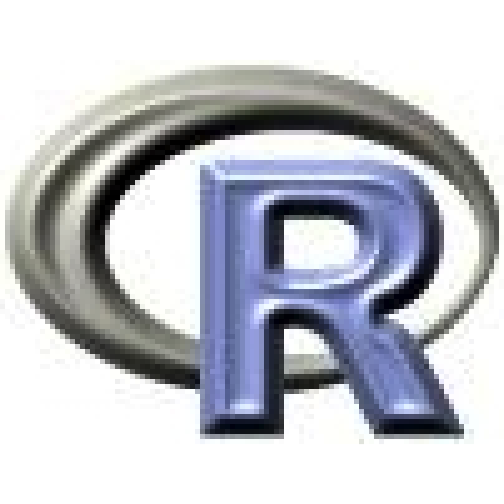

Working with raster data
========================================================
the `raster` package


```r
summary(sgdf)
```

```
Object of class SpatialGridDataFrame
Coordinates:
     min max
[1,]   0 100
[2,]   0 100
Is projected: NA 
proj4string : [NA]
Grid attributes:
  cellcentre.offset cellsize cells.dim
1               0.5        1       100
2               0.5        1       100
Data attributes:
 as.vector.surf.  
 Min.   :-2.7178  
 1st Qu.:-0.7324  
 Median :-0.1878  
 Mean   :-0.1891  
 3rd Qu.: 0.3430  
 Max.   : 2.8305  
```

Working with raster data
========================================================
the `raster` package


```r
r = raster(sgdf)
summary(r)
```

```
        as.vector.surf.
Min.         -2.7178473
1st Qu.      -0.7324029
Median       -0.1877568
3rd Qu.       0.3430456
Max.          2.8305238
NA's          0.0000000
```

Working with raster data
========================================================
the `raster` package


```r
r = raster(sgdf)
plot(r)
```

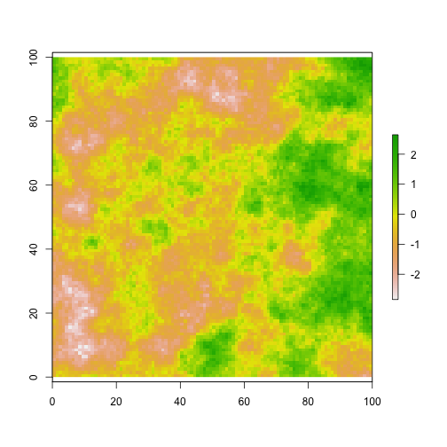

Working with raster data
========================================================
type: sub-section
- Raster data
- `sp` raster classes
- the `raster` package
- **correlogram example**

Working with raster data
========================================================
the `raster` package


```r
expsurf = data.frame(cbind(coordinates(r), values(r)))
names(expsurf) = c("x", "y", "z")
head(expsurf)
```

```
    x    y            z
1 0.5 99.5 -0.074299219
2 1.5 99.5 -0.142481434
3 2.5 99.5  0.065050945
4 3.5 99.5 -0.009893408
5 4.5 99.5  0.570003726
6 5.5 99.5  0.666561948
```

Working with raster data
========================================================
the `raster` package


```r
library(spatial)
es.kr = surf.ls(2, expsurf)   # a Kriging model
correlogram(es.kr, 100, xlim = c(0, 30))
```

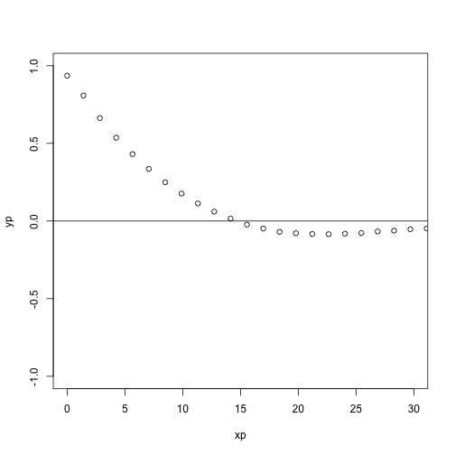

Working with raster data
========================================================
the `raster` package


```r
correlogram(es.kr, 100, xlim = c(0, 30), cex = 2, pch = 19)
d = seq(0, 30, 0.5)
lines(d, expcov(d, 5), lwd = 3, col = "red")
```

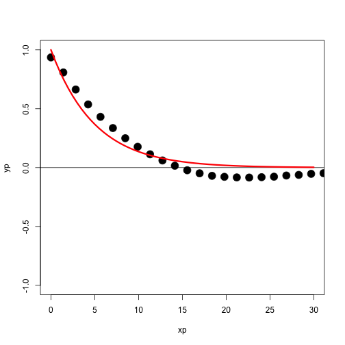

Working with raster data
========================================================
type: sub-section
- Raster data
- `sp` raster classes
- the `raster` package
- correlogram example
