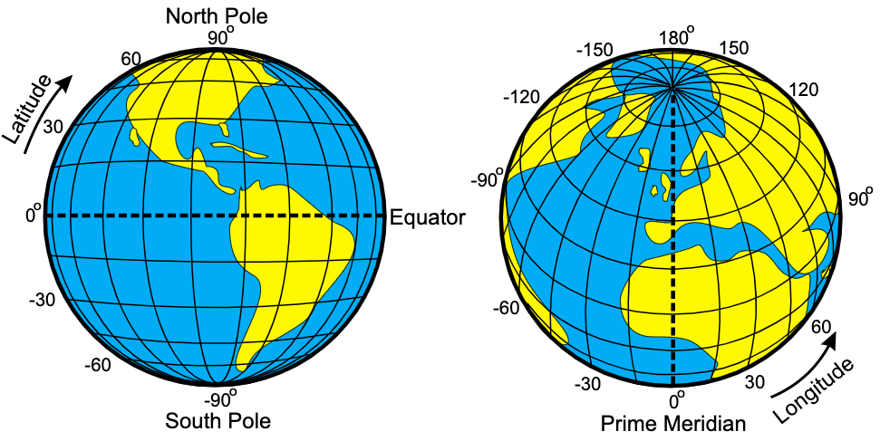

<!--
f you are reading this document in raw form, it it written in rmarkdown.
See https://rmarkdown.rstudio.com/
-->

```{r, include = FALSE}
knitr::opts_chunk$set(
  collapse = TRUE,
  comment = "#>"
)
```

```{r setup, include=FALSE}
library(keitt.ssi.2019)
```

# What are geospatial data?

Geospatial data are measurements or recordings that are associated with a location on Earth. The most familiar type of location information are **geographical coordinates** given in degrees latitude and longitude and defining a point on the Earth's surface. However, geospatial data may be associated with line-transects, aerial regions or continuous spatial fields depending on the application.

```{r echo=FALSE, out.width='80%', fig.cap="Illustration of latitude and longitude", fig.align='center'}

```

Give a GPS, a latitude and a longitude, we can get pretty close to the intended location. Much of the uncertainty in the location will be due to the properties of the GPS itself, however some will also derive from the fact that any geospatial location is really **a model** with no exact corresponding point on the Earth's surface. With a lot of fancy tricks, one can get down to centimeter-scale accuracy. The important point to understand is that just like any scientific measurement, a specification of location is uncertain and depends on a model.

The other type of coordinates commonly encountered are **cartesian coordinates**, sometimes also called **map coordinates** as they are used when the surface of the Earth is projected onto a flat plane as in printing a map. We will consider the details of map projects later.

```{r echo=FALSE, out.width='80%', fig.cap="Illustration of cartesian map coordinates", fig.align='center'}
knitr::include_graphics('./cartesian-projection.png')
```

# The two main types of geospatial data

In the development of geographical information systems, two major ways of storing geospatial data emerged. You will generally find that data come in either **raster** form or **vector** form.

```{r echo=FALSE, out.width='80%', fig.cap="Comparison of raster and vector GIS data structures", fig.align='center'}
knitr::include_graphics('./Raster_vector_tikz.png')
```

**Raser data** represent spatial fields of repeated measurements. These are the types of data that you download from your digitial camera, which records the intensity of red, green and blue light in a regular grid. Similarly, satelite imagery records electromagnetic radiation of various wavelengths reflected off the Earth's surface. Another example, would be a regular grid of topographic elevations called a Digital Elevation Model (DEM).

In the computer, a raster image is stored as a sequence of values where each successive value is the next pixel along a row (or column) and rows (columns) are appended sequentially. Most software provides a grid or matrix-like view of the data where you can extract rows, columns or tiles of values. When combined with spatial metadata associating the grid with a location, one can find the coordinates of each pixel by the count of rows and column offset from a reference, typically the location of one of the corner pixels (and information about rotation of the grid off of true north). In R, raster data are most commonly manipulated with the [raster package](https://cran.r-project.org/package=raster).

**Vector data** are stored as coordinate pairs or points. In GIS, we usually use 2D points representing a location on the Earth's surface, however we can generalize to 3D location-elevation or 4D space-time coordinates. Note that a sequence of points forms a linestring and a linestring enclosing a region forms a polygon. These are the three principal data structures in vector GIS: **point**, **linestring** and **polygon**. Most software will provide access to a collection of points, linestrings or polygons as a sequential list where each element can be accessed in turn or by offset. Additionally, it is usually possible to access and manipulate each point individually in a linestring or polygon. Manipulating vector data is usually done with the [sf](https://cran.r-project.org/package=sf) package.

```{r echo=FALSE, out.width='80%', fig.cap="Example point, linestring and polygon", fig.align='center'}
knitr::include_graphics('./sdo_int3.gif')
```

The major difference between vector and raster is that with vector data, the coordinates of every single measurement are contained in the dataset, whereas with raster data, the only a single coordinate pair (or in many cases one for each corner pixel) is contained in the dataset. I call this difference **explicit** versus **implicit** referencing. The raster format omits this extra information to save space and make lookups much faster than if we had to search for a particular location among all the pixel coordinates. In computerese, searching for vector coordinates grows linearly ($\mathcal{O}(n)$) with the size of the dataset (or logarithmically---$\mathcal{O}(\log n)$---in the case of hiearchical indexes) and searching for pixels in a raster in a constant-time operation ($\mathcal{O}(1)$). Note that it is trivially easy to convert a raster dataset to a vector dataset by simply replacing the set of pixels with a set of explicit points, each labeled with the pixel value. This will expand the memory requirments for manipulating the data, but is nonetheless sometimes convenient for small to maderately sized rasters.

# Working with R

R is a computer language designed to facilitate data analysis and model building. It originated as a free and open source alternative to S+, a commercial implementation of S+. The S language was designed by John Chambers at ATT Bell Labs. R has proven to be spectacularly successful and is now essentially required knowledge in data-driven research fields. A set of slides giving an overview can be downloaded [here](https://www.stat.auckland.ac.nz/~ihaka/downloads/Massey.pdf) (PDF format).

There are a vast array of resources available for learning R, so I will not attempt to teach the language here. Your main waypoint in getting started is the [R website](http://www.r-project.org), and of course [Google is your friend](http://www.google.com/search?q=r+tutorial). Also look at [this](https://r4ds.had.co.nz/), [this](http://r-pkgs.had.co.nz/), and [this](http://adv-r.had.co.nz/); because of excellent writing, they are more approachable for beginners than their titles suggest.

As a quick example of what you might do in R, consider:

First load some needed [packages](https://cran.r-project.org/web/packages/).

```{r message=FALSE, warning=FALSE}
library(tibble)
library(ggplot2)
```

Now do some work.

```{r}
x <- rnorm(20)
y <- 2 * x + 1 + rnorm(20)
xy <- tibble(x, y)
p1 <- ggplot(xy, aes(x = x, y = y)) + geom_point()
print(p1)
```

Here we have simulated some data and made a plot. Now lets build a model.

```{r}
m1 <- lm(y ~ x, data = xy)
summary(m1)
intercept <- coefficients(m1)[1]
slope <- coefficients(m1)[2]
p1 <- p1 + geom_abline(slope = slope, intercept = intercept, color = "steelblue")
print(p1)
```

These examples us the [ggplot2](https://ggplot2.tidyverse.org/) and [tibble](https://tibble.tidyverse.org/) packages that are part of the [tidyverse](https://www.tidyverse.org/), a suite of modern tools for R that follow a consistent 'tidy' approach. A complete guide is [here](https://r4ds.had.co.nz/) and is highly recommended.

To get help in R, try the following:

```{r prompt=TRUE}
help("ls")
?ls
help.search("directory")
??directory
```

Note: there is a bug in the latest version of RStudio which causes help searches to fail! You can also use Google.

# Using RStudio

You should be working in [RStudio](https://www.rstudio.com/products/RStudio/). I highly recommend forming two habits whenever you are using RStudio.

First, always create a **project**. Go to File > New Project... in the menus and create a project. Put all of your code and results in the project directory or in subdirectories under the project directory. I keep my projects on cloud storage like [Dropbox](https://www.dropbox.com/) or [Box](https://www.box.com/). When writing packages, I also sync with [GitHub](https://github.com/).

Second, **do not type code directly into the console**. I highly recommend that you always create a file and place your commands into that file. RStudio makes it easy to run those commands singly or all at once. There are three choices in the File > New File menu: R Script, R Notebook, and R Markdown.... I recommend using the notebook interface as it lets you intermix markdown text with R code chunks. However, many first-timers prefer a simple script with embedded comments as it is simpler at first. Use an R markdown file to create standalone documents.

